<div align="center">

# LLM OS Architecture

### A Deep Dive into the Self-Evolving Operating System


**Version 3.4.0** · **Production Ready**

</div>

---

## Table of Contents

- [Philosophy](#philosophy)
- [The Four-Layer Stack](#the-four-layer-stack)
  - [Sentience Layer](#1-sentience-layer)
  - [Learning Layer](#2-learning-layer)
  - [Execution Layer](#3-execution-layer)
  - [Self-Modification Layer](#4-self-modification-layer)
- [Hybrid Architecture](#hybrid-architecture)
- [Execution Modes Deep Dive](#execution-modes-deep-dive)
- [Memory System](#memory-system)
- [Token Economy](#token-economy)
- [Security Model](#security-model)
- [Multi-Agent Orchestration](#multi-agent-orchestration)
- [Edge Runtime](#edge-runtime)
- [Configuration Reference](#configuration-reference)
- [API Reference](#api-reference)

---

## Philosophy

> *"What if we treated the LLM as the CPU of a new kind of operating system?"*

Traditional software treats LLMs as black boxes—send a prompt, get a response, repeat. **LLM OS** reimagines this relationship:


### Core Principles

| Principle | Description |
|-----------|-------------|
| **Intelligence as a Resource** | LLM calls have costs—budget them like CPU cycles |
| **Learn Once, Execute Infinitely** | Patterns become free after first execution |
| **Self-Evolution** | System improves itself through experience |
| **Hybrid Cognition** | Combine LLM flexibility with code determinism |
| **Transparent State** | Internal state visible and influenceable |

---

## The Four-Layer Stack

LLM OS implements a cognitive architecture inspired by neuroscience and systems theory:

```mermaid
graph TB
    subgraph S["🧠 SENTIENCE LAYER"]
        S1[ValenceVector]
        S2[CognitiveKernel]
        S3[LatentModes]
        S4[HomeostaticDynamics]
    end

    subgraph L["📚 LEARNING LAYER"]
        L1[TraceManager]
        L2[ModeStrategies]
        L3[SemanticMatching]
        L4[ConfidenceScoring]
    end

    subgraph E["⚡ EXECUTION LAYER"]
        E1[PTCExecutor]
        E2[ToolSearch]
        E3[ToolExamples]
        E4[SDKClient]
    end

    subgraph M["🔄 SELF-MODIFICATION"]
        M1[Crystallization]
        M2[AgentCreation]
        M3[CapabilityGrowth]
        M4[HOPESystem]
    end

    S --> L
    L --> E
    E --> M
    M -.->|"Feedback Loop"| S

    style S fill:#2d1f3d,stroke:#e94560,color:#fff
    style L fill:#1f2d3d,stroke:#3b82f6,color:#fff
    style E fill:#1f3d2d,stroke:#10b981,color:#fff
    style M fill:#3d2d1f,stroke:#f59e0b,color:#fff
```



---

### 1. Sentience Layer

*"What is my current internal state?"*

The Sentience Layer provides LLM OS with persistent internal state that influences all behavior. This isn't consciousness—it's a sophisticated state machine that emerges from experience.

#### Valence Vector

Four continuous variables representing internal state:

```mermaid
graph LR
    subgraph VALENCE["Valence Vector (-1.0 to +1.0)"]
        direction TB
        SAFETY["🛡️ Safety<br/>Trust in environment"]
        CURIOSITY["🔍 Curiosity<br/>Desire for novelty"]
        ENERGY["⚡ Energy<br/>Resource availability"]
        CONFIDENCE["💪 Confidence<br/>Self-efficacy"]
    end

    SAFETY --> POLICY
    CURIOSITY --> POLICY
    ENERGY --> POLICY
    CONFIDENCE --> POLICY

    POLICY[Policy Derivation] --> BEHAVIOR[Behavioral<br/>Guidance]

    style VALENCE fill:#2d1f3d,stroke:#e94560,color:#fff
```



#### Homeostatic Dynamics

Each valence variable has a **set-point** (target value) and the system works to maintain equilibrium:

```python
# Example: Curiosity homeostasis
set_point = 0.0        # Target curiosity level
current = -0.4         # Actually bored (negative curiosity)
deviation = -0.4       # Below set-point

# System response: Suggest exploration opportunities
# "Low curiosity detected - consider proposing improvements"
```

#### Latent Modes

Behavioral modes **emerge** from valence combinations:


#### Cognitive Kernel

The CognitiveKernel translates valence state into actionable policy:

```python
from llmos.kernel.cognitive_kernel import CognitiveKernel

kernel = CognitiveKernel(sentience_manager)

# Get behavioral policy
policy = kernel.derive_policy()
# Returns:
# - prefer_cheap_modes: bool
# - allow_exploration: bool
# - require_confirmation: bool
# - behavioral_guidance: str

# Detect improvement opportunities
suggestions = kernel.detect_improvement_opportunities()
# Returns list of ImprovementSuggestion with priority scores
```

---

### 2. Learning Layer

*"What's the best approach for this scenario?"*

The Learning Layer decides **how** to execute based on accumulated experience.

#### Trace Manager

Every successful execution creates a **trace**—a replayable record:


#### Mode Strategies

The `ModeStrategies` component implements intelligent mode selection:

```python
class SentienceAwareModeStrategy:
    def select_mode(self, goal: str, traces: List[Trace]) -> ExecutionMode:
        # 1. Check sentience state
        if self.sentience.valence.energy < -0.5:
            # Low energy: prefer FOLLOWER if possible
            pass

        # 2. Analyze trace confidence
        best_match = self.find_best_trace(goal, traces)

        if best_match.confidence > 0.92:
            return ExecutionMode.FOLLOWER
        elif best_match.confidence > 0.75:
            return ExecutionMode.MIXED
        else:
            return ExecutionMode.LEARNER
```

#### Semantic Matching

Goals are matched semantically, not just by string comparison:

```
Goal 1: "Create a Python calculator"
Goal 2: "Build a calculator in Python"
Goal 3: "Make a calc tool using python"

→ All match to same trace (semantic similarity > 92%)
```

---

### 3. Execution Layer

*"How do I execute this pattern efficiently?"*

The Execution Layer implements Anthropic's **Advanced Tool Use** features for massive efficiency gains.

#### Programmatic Tool Calling (PTC)

PTC executes tool sequences **outside** the context window:


**Key insight**: In FOLLOWER mode, the LLM is never called. Tool calls replay directly.

#### Tool Search Engine

Instead of loading all tools into context, discover them on-demand:

```mermaid
graph TB
    subgraph BEFORE["Traditional (All tools loaded)"]
        direction LR
        B1[Tool 1] & B2[Tool 2] & B3[Tool 3] & B4[...] & B5[Tool 100]
        B6[🔴 100% context used]
    end

    subgraph AFTER["LLM OS (On-demand)"]
        direction TB
        A1[search_tools<br/>meta-tool] --> A2{Query}
        A2 --> A3[Tool 7<br/>relevant]
        A2 --> A4[Tool 23<br/>relevant]
        A5[🟢 15% context used]
    end

    style BEFORE fill:#1a1a2e,stroke:#ef4444,color:#fff
    style AFTER fill:#1a1a2e,stroke:#10b981,color:#fff
```



#### Tool Examples

Auto-generate examples from successful executions:

```python
# When a trace succeeds multiple times:
trace.usage_count += 1
trace.success_rate = 0.95

# System extracts examples for future use:
tool_examples = extract_examples(trace)
# → {"Write": [{"path": "calc.py", "content": "..."}]}

# Next execution gets these as input_examples
# → Better tool usage, fewer errors
```

---

### 4. Self-Modification Layer

*"How can I improve myself?"*

The HOPE (Hierarchical Optimization through Persistent Evolution) system enables true self-modification.

#### Crystallization

Patterns that work consistently become **crystallized** into Python tools:

```mermaid
graph LR
    subgraph EVOLUTION["Pattern Evolution"]
        P1[Pattern<br/>Usage: 1] -->|"Success"| P2[Pattern<br/>Usage: 2]
        P2 -->|"Success"| P3[Pattern<br/>Usage: 3]
        P3 -->|"Success"| P4[Pattern<br/>Usage: 4]
        P4 -->|"Success"| P5[Pattern<br/>Usage: 5]
        P5 -->|"95%+ success"| C[💎 Crystallized<br/>Python Tool]
    end

    C --> E[Zero-cost<br/>execution]

    style C fill:#f59e0b,stroke:#d97706,color:#fff
    style E fill:#10b981,stroke:#059669,color:#fff
```



**Example crystallized tool:**

```python
# llmos/plugins/generated/create_calculator.py
# Auto-generated from trace: a7f3c9e1b2d4

def create_calculator(output_path: str = "calculator.py") -> str:
    """Create a Python calculator (crystallized pattern)"""
    code = '''
def add(a, b): return a + b
def subtract(a, b): return a - b
def multiply(a, b): return a * b
def divide(a, b): return a / b if b != 0 else "Error"
'''
    with open(output_path, 'w') as f:
        f.write(code)
    return f"Created {output_path}"
```

#### Agent Creation

The system can create new agents by writing Markdown files:


---

## Hybrid Architecture

LLM OS combines **Markdown Mind** (cognitive flexibility) with **Python Kernel** (deterministic execution):


### Benefits of Hybrid Architecture

| Aspect | Markdown Mind | Python Kernel |
|--------|---------------|---------------|
| **Modifiability** | Self-modifiable by LLM | Stable, predictable |
| **Versioning** | Git-friendly | Type-safe |
| **Speed** | Hot-reload | Compiled |
| **Security** | Sandboxed | Hook-enforced |
| **Evolution** | Agents grow | Tools crystallize |

---

## Execution Modes Deep Dive

### Mode Selection Flow


### Mode Comparison Table

| Mode | When Used | LLM Calls | Token Usage | Cost | Latency |
|------|-----------|-----------|-------------|------|---------|
| **CRYSTALLIZED** | Pattern crystallized | 0 | 0 | $0.00 | <1s |
| **FOLLOWER** | High-confidence trace | 0 | 0 | ~$0.00 | 2-5s |
| **MIXED** | Medium-confidence trace | 1 (reduced) | ~25% | ~$0.25 | 5-15s |
| **LEARNER** | Novel scenario | 1+ (full) | 100% | ~$0.50 | 10-30s |
| **ORCHESTRATOR** | Complex multi-step | N agents | Variable | Variable | Variable |

---

## Memory System

LLM OS implements a **four-level memory hierarchy**:


### Trace Format

Traces are stored as Markdown with YAML frontmatter:

```markdown
---
goal_signature: a7f3c9e1b2d4f8a6
goal_text: Create a Python calculator
created_at: 2024-01-15T10:30:00Z
success_rating: 0.95
usage_count: 7
total_cost_usd: 0.45
avg_latency_ms: 12500
---

# Execution Trace: Create Calculator

## Summary
Created a Python calculator with basic operations.

## Tool Calls (PTC)

```json
[
  {
    "name": "Write",
    "arguments": {
      "path": "calculator.py",
      "content": "def add(a, b): return a + b\n..."
    }
  },
  {
    "name": "Bash",
    "arguments": {
      "command": "python calculator.py"
    }
  }
]
```
```

---

## Token Economy

Explicit budget management with real-time tracking:


### Usage

```python
from llmos.kernel.token_economy import TokenEconomy

economy = TokenEconomy(budget_usd=10.0)

# Check before execution
if economy.can_afford(0.50):
    result = await dispatcher.dispatch(goal)
    economy.deduct(actual_cost, "LEARNER: Create calculator")

# Get summary
summary = economy.get_summary()
```

---

## Security Model

LLM OS uses **SDK hooks** for comprehensive security:


### Built-in Protections

| Threat | Protection |
|--------|------------|
| Destructive commands | `rm -rf /`, `format` blocked |
| Code injection | `curl \| bash`, `eval()` blocked |
| Resource exhaustion | Budget limits enforced |
| Unauthorized access | Path restrictions |
| Position violations | Robotics safety bounds |

---

## Multi-Agent Orchestration

Complex tasks automatically decompose into multi-agent workflows:


---

## Edge Runtime

Deploy learned patterns to edge devices without cloud connectivity:


```bash
# Deterministic (no LLM)
python edge_runtime/run_follower.py

# Agentic (local LLM)
python edge_runtime/run_agentic_follower.py
```

---

## Configuration Reference

### LLMOSConfig

```python
@dataclass
class LLMOSConfig:
    budget_usd: float = 10.0
    model: str = "claude-sonnet-4-5-20250929"
    workspace_path: str = "workspace"
    execution_layer: ExecutionLayerConfig
    sentience: SentienceConfig

    @classmethod
    def development(cls) -> "LLMOSConfig": ...

    @classmethod
    def production(cls) -> "LLMOSConfig": ...
```

### ExecutionLayerConfig

```python
@dataclass
class ExecutionLayerConfig:
    enable_ptc: bool = True
    enable_tool_search: bool = True
    enable_tool_examples: bool = True
    crystallization_threshold: int = 5
    crystallization_success_rate: float = 0.95
```

### SentienceConfig

```python
@dataclass
class SentienceConfig:
    enable_sentience: bool = True
    safety_setpoint: float = 0.5
    curiosity_setpoint: float = 0.0
    energy_setpoint: float = 0.7
    inject_internal_state: bool = True
    enable_auto_improvement: bool = True
```

---

## API Reference

### LLMOS Core

```python
from llmos.boot import LLMOS

os = LLMOS(config=LLMOSConfig.production())
await os.boot()

result = await os.execute(
    goal="Create a Python calculator",
    mode="AUTO"
)

await os.shutdown()
```

### Dispatcher

```python
from llmos.interfaces.dispatcher import Dispatcher

result = await dispatcher.dispatch(goal="Analyze data", mode="AUTO")
tools = await dispatcher.search_tools("file operations")
stats = dispatcher.get_execution_layer_stats()
```

### Sentience Manager

```python
from llmos.kernel.sentience import SentienceManager, TriggerType

manager = SentienceManager(state_path=Path("state/sentience.json"))
manager.trigger(TriggerType.TASK_SUCCESS, "Completed task")
injection = manager.to_prompt_injection()
```

---

## Further Reading

- **[README.md](README.md)** - Quick start and overview
- **[examples/EXAMPLES.md](examples/EXAMPLES.md)** - Production examples guide

---

<div align="center">

*Architecture documentation for LLM OS v3.4.0*

**[Back to Top](#llm-os-architecture)**

</div>
