# LLM OS Architecture

**Version 3.6.0**

---

## The Big Picture

LLM OS is built on a revolutionary idea: **AI systems should evolve continuously, not just execute tasks**.

At its core are three interconnected systems:

```mermaid
graph TB
    subgraph Core["🎯 The Living System"]
        direction TB
        V["📦 Volumes<br/>Where knowledge lives"]
        C["🤖 Sentience Crons<br/>Background evolution"]
        O["📊 Observability<br/>Full transparency"]
    end

    V <-->|"read/write"| C
    C -->|"record events"| O
    O -->|"notify users"| V

    style Core fill:#1e1b4b,color:#fff
    style V fill:#6366f1,color:#fff
    style C fill:#8b5cf6,color:#fff
    style O fill:#a78bfa,color:#fff
```

Everything else - sentience state, learning traces, adaptive agents, execution modes - are **mechanisms that enable this living system**.

---

## Part 1: Volumes - Where Knowledge Lives

### The Three-Tier Hierarchy

Knowledge in LLM OS is organized into three scoped volumes, each with its own purpose and access rules:

```mermaid
graph TB
    subgraph SV["🌐 SYSTEM VOLUME"]
        direction LR
        S1["Universal Tools"]
        S2["Global Agents"]
        S3["Cross-org Patterns"]
    end

    subgraph TV["👥 TEAM VOLUME"]
        direction LR
        T1["Team Tools"]
        T2["Team Agents"]
        T3["Team Insights"]
    end

    subgraph UV["👤 USER VOLUME"]
        direction LR
        U1["Personal Tools"]
        U2["My Agents"]
        U3["My Traces"]
        U4["My Insights"]
    end

    UV -->|"🚀 Promote"| TV
    TV -->|"🚀 Promote"| SV

    SV -.->|"📥 Inherit"| TV
    TV -.->|"📥 Inherit"| UV

    style SV fill:#dc2626,color:#fff
    style TV fill:#ea580c,color:#fff
    style UV fill:#16a34a,color:#fff
```

### Volume Contents

Each volume stores five artifact types:

```mermaid
graph LR
    subgraph Volume["📦 Any Volume"]
        direction TB
        Traces["📜 Traces<br/>*.md"]
        Tools["🔧 Tools<br/>*.py"]
        Agents["🤖 Agents<br/>*.md"]
        Insights["💡 Insights<br/>*.md"]
        Suggestions["🎯 Suggestions<br/>*.md"]
    end

    Traces -->|"crystallize"| Tools
    Traces -->|"analyze"| Insights
    Insights -->|"generate"| Suggestions
    Suggestions -->|"create"| Agents
    Tools -->|"improve"| Tools

    style Traces fill:#3b82f6,color:#fff
    style Tools fill:#10b981,color:#fff
    style Agents fill:#8b5cf6,color:#fff
    style Insights fill:#f59e0b,color:#fff
    style Suggestions fill:#ec4899,color:#fff
```

| Artifact | Format | Purpose | Evolution Path |
|----------|--------|---------|----------------|
| **Traces** | Markdown | Execution records | → Summarize → Crystallize |
| **Tools** | Python | Reusable capabilities | → Optimize → Promote |
| **Agents** | Markdown | AI personalities | → Refine → Enhance |
| **Insights** | Markdown | Discovered patterns | Generated by analysis |
| **Suggestions** | Markdown | Improvement ideas | Generated by crons |

### Access Control Matrix

```mermaid
graph LR
    subgraph Access["Who Can Access What"]
        direction TB

        UC["👤 UserCron"]
        TC["👥 TeamCron"]
        SC["🌐 SystemCron"]

        UV2["User Vol"]
        TV2["Team Vol"]
        SV2["System Vol"]
    end

    UC -->|"read/write"| UV2
    UC -.->|"read only"| TV2

    TC -->|"read/write"| TV2
    TC -.->|"read only"| SV2

    SC -->|"read/write"| UV2
    SC -->|"read/write"| TV2
    SC -->|"read/write"| SV2

    style UC fill:#16a34a,color:#fff
    style TC fill:#ea580c,color:#fff
    style SC fill:#dc2626,color:#fff
```

| Cron | User Volume | Team Volume | System Volume |
|------|-------------|-------------|---------------|
| **UserCron** | Read/Write | Read Only | - |
| **TeamCron** | Read Only | Read/Write | Read Only |
| **SystemCron** | Read/Write | Read/Write | Read/Write |

### The Promotion Journey

Artifacts flow upward through the hierarchy based on proven value:

```mermaid
sequenceDiagram
    participant U as 👤 User Volume
    participant T as 👥 Team Volume
    participant S as 🌐 System Volume

    Note over U: Tool created from<br/>repeated pattern

    U->>U: Tool used 5+ times
    U->>U: Success rate > 95%

    Note over U,T: UserCron flags for promotion

    U->>T: 🚀 Promote tool
    T->>T: Available to team

    Note over T: Team uses tool successfully

    T->>T: Used by 3+ users
    T->>T: High success rate

    Note over T,S: TeamCron flags for promotion

    T->>S: 🚀 Promote to system
    S->>S: Available to everyone
```

---

## Part 2: Sentience Crons - The Living Processes

### What Makes Them "Sentient"?

Unlike traditional cron jobs that blindly execute, Sentience Crons are **creative thinking partners**:

- **Understand context** - They know what artifacts mean and how they relate
- **Think creatively** - They suggest new approaches, not just optimize existing ones
- **Predict next steps** - They anticipate what you might need next
- **Learn across boundaries** - They learn from your work, team patterns, AND system knowledge
- **Make decisions** - They propose, don't just execute
- **Respect state** - They consider safety, energy, curiosity

```mermaid
graph TB
    subgraph Capabilities["🧠 Cron Capabilities"]
        direction TB
        C1["📊 Trace Analysis<br/>Understand work patterns"]
        C2["✨ Artifact Evolution<br/>Improve existing tools"]
        C3["💡 Creative Suggestions<br/>New approaches to problems"]
        C4["🔮 Next Step Prediction<br/>Anticipate needs"]
        C5["🔗 Cross-Learning<br/>Learn from team & system"]
    end

    subgraph Sources["📚 Knowledge Sources"]
        S1["👤 Your traces"]
        S2["👥 Team artifacts"]
        S3["🌐 System patterns"]
    end

    Sources --> Capabilities

    style Capabilities fill:#6366f1,color:#fff
    style Sources fill:#10b981,color:#fff
```

```mermaid
graph TB
    subgraph Cron["🤖 A Sentience Cron"]
        direction TB
        Input["📥 Read volumes"]
        Analyze["🔍 Analyze artifacts"]
        Decide["🧠 Make decisions"]
        Propose["📝 Create proposals"]
        Execute["⚡ Apply changes"]
        Report["📊 Record to hub"]
    end

    Input --> Analyze --> Decide --> Propose --> Execute --> Report
    Report -.-> Input

    style Cron fill:#1e1b4b,color:#fff
    style Decide fill:#6366f1,color:#fff
    style Report fill:#10b981,color:#fff
```

### The Cron Hierarchy


### Cron Responsibilities

#### UserCron (Personal Evolution)

```mermaid
graph LR
    subgraph UC["👤 UserCron Tasks"]
        direction TB
        T1["📜 Analyze recent traces"]
        T2["🔍 Detect patterns"]
        T3["💎 Propose crystallization"]
        T4["💡 Generate insights"]
        T5["🎯 Create suggestions"]
        T6["🚀 Flag for promotion"]
    end

    T1 --> T2 --> T3
    T2 --> T4 --> T5
    T4 --> T6

    style UC fill:#16a34a,color:#fff
```

- **Schedule**: Every 30 minutes
- **Scope**: Personal user volume
- **Key outputs**: Insights, suggestions, crystallization proposals

#### TeamCron (Team Evolution)

```mermaid
graph LR
    subgraph TC["👥 TeamCron Tasks"]
        direction TB
        T1["📊 Aggregate user patterns"]
        T2["🔗 Find common tools"]
        T3["📈 Track team metrics"]
        T4["🚀 Promote from users"]
        T5["💡 Team-wide insights"]
    end

    T1 --> T2 --> T4
    T1 --> T3 --> T5

    style TC fill:#ea580c,color:#fff
```

- **Schedule**: Every 1 hour
- **Scope**: Team volume + read user volumes
- **Key outputs**: Promoted artifacts, team insights

#### SystemCron (Global Evolution)

```mermaid
graph LR
    subgraph SC["🌐 SystemCron Tasks"]
        direction TB
        T1["🎛️ Coordinate all crons"]
        T2["🌍 Global pattern analysis"]
        T3["🚀 Promote from teams"]
        T4["🧹 Cleanup old artifacts"]
        T5["❤️ System health checks"]
    end

    T1 --> T2 --> T3
    T2 --> T4
    T1 --> T5

    style SC fill:#dc2626,color:#fff
```

- **Schedule**: Every 2 hours
- **Scope**: All volumes
- **Key outputs**: System tools, health reports, coordinated evolution

### Evolution Engine

The Evolution Engine is the brain behind artifact improvement:


---

## Part 3: Observability - Full Transparency

### The ObservabilityHub

Every action in the system flows through the ObservabilityHub:

```mermaid
graph TB
    subgraph Sources["Event Sources"]
        UC["👤 UserCrons"]
        TC["👥 TeamCrons"]
        SC["🌐 SystemCron"]
        EE["✨ Evolution Engine"]
    end

    subgraph Hub["📊 ObservabilityHub"]
        direction TB
        Store["EventStore"]
        Query["Query Engine"]
        Format["Formatters"]
        Sub["Subscribers"]
    end

    subgraph Outputs["User Interfaces"]
        Feed["📋 Activity Feed"]
        Notif["📬 Notifications"]
        Report["📈 Reports"]
        RT["⚡ Real-time"]
    end

    UC -->|"events"| Store
    TC -->|"events"| Store
    SC -->|"events"| Store
    EE -->|"events"| Store

    Store --> Query
    Query --> Format
    Format --> Feed
    Format --> Notif
    Format --> Report

    Store --> Sub --> RT

    style Hub fill:#6366f1,color:#fff
    style Store fill:#8b5cf6,color:#fff
```

### Event Types


### Notification Flow


### Query Capabilities

```python
# Get activity feed
activity = hub.get_activity_feed(
    cron_id="user:alice",      # Filter by cron
    since_hours=24,            # Time range
    limit=50                   # Max results
)

# Get artifact changes
changes = hub.get_artifact_changes(
    volume_type="user",        # user/team/system
    artifact_type="tool",      # trace/tool/agent/insight/suggestion
    limit=20
)

# Get pending notifications
notifications = hub.get_pending_notifications()

# Get global summary
summary = hub.get_global_summary()
# Returns: {
#   "artifacts_created": 12,
#   "artifacts_evolved": 5,
#   "insights_generated": 8,
#   "pending_notifications": 3
# }
```

---

## Part 4: The Cron Terminal - Interactive Dashboard

The Cron Terminal provides a visual interface to monitor and interact with your crons in real-time.

### Terminal Layout

```
┌─────────────────────────────────────┬────────────────────────────────────────────────┐
│ 🤖 CRON PROCESSES                   │ 📋 DETAIL PANEL                                │
│                                     │                                                │
│ ┌─ Tree View ─────────────────────┐ │ ┌─ Thinking Process ─────────────────────────┐ │
│ │                                 │ │ │ Current cognitive state of selected cron   │ │
│ │ ▼ 🧠 SystemCron                 │ │ │ Shows live analysis and reasoning          │ │
│ │   ├─▼ 👥 TeamCron:engineering   │ │ └─────────────────────────────────────────────┘ │
│ │   │   ├─ 👤 UserCron:alice ◄── │ │                                                │
│ │   │   └─ 👤 UserCron:bob       │ │ ┌─ Suggestions ────────────────────────────────┐ │
│ │   └─▼ 👥 TeamCron:design       │ │ │ Next steps predicted by the cron            │ │
│ │       └─ 👤 UserCron:carol     │ │ │ Creative approaches based on cross-learning │ │
│ │                                 │ │ └─────────────────────────────────────────────┘ │
│ └─────────────────────────────────┘ │                                                │
│                                     │ ┌─ Activity Log ──────────────────────────────┐ │
│ ┌─ Status Bar ────────────────────┐ │ │ Recent events from this cron                │ │
│ │ Each cron shows:                │ │ └─────────────────────────────────────────────┘ │
│ │ - Current activity              │ │                                                │
│ │ - Pending notifications         │ │ ┌─ Interaction ───────────────────────────────┐ │
│ │ - Last cycle time               │ │ │ Chat with YOUR cron (UserCron only)         │ │
│ └─────────────────────────────────┘ │ │ Read-only for team/system crons             │ │
│                                     │ └─────────────────────────────────────────────┘ │
└─────────────────────────────────────┴────────────────────────────────────────────────┘
```

### Panel Architecture

```mermaid
graph TB
    subgraph Terminal["🖥️ Cron Terminal"]
        direction LR

        subgraph Left["Left Panel: Tree View"]
            direction TB
            Tree["Cron Hierarchy"]
            Status["Live Status"]
            Nav["Navigation"]
        end

        subgraph Right["Right Panel: Detail View"]
            direction TB
            Think["💭 Thinking Process"]
            Suggest["💡 Suggestions"]
            Activity["📋 Activity Log"]
            Chat["💬 Interaction"]
        end

        Left --> Right
    end

    subgraph Data["Data Sources"]
        Hub["ObservabilityHub"]
        Crons["Active Crons"]
        Vol["Volumes"]
    end

    Data --> Terminal

    style Terminal fill:#1e1b4b,color:#fff
    style Left fill:#6366f1,color:#fff
    style Right fill:#8b5cf6,color:#fff
```

### Left Panel: Cron Tree

The tree shows all crons in the system hierarchy with live status:

```mermaid
graph TB
    subgraph TreeView["🌳 Cron Tree"]
        SC["🧠 SystemCron"]
        TC1["👥 TeamCron:engineering"]
        TC2["👥 TeamCron:design"]
        UC1["👤 UserCron:alice [YOU]"]
        UC2["👤 UserCron:bob"]
        UC3["👤 UserCron:carol"]

        SC --> TC1
        SC --> TC2
        TC1 --> UC1
        TC1 --> UC2
        TC2 --> UC3
    end

    subgraph Status["Status Indicators"]
        S1["💭 Thinking..."]
        S2["✅ Idle"]
        S3["🔔 2 notifications"]
        S4["⏱️ Last: 5m ago"]
    end

    style TreeView fill:#1e1b4b,color:#fff
    style SC fill:#dc2626,color:#fff
    style TC1 fill:#ea580c,color:#fff
    style TC2 fill:#ea580c,color:#fff
    style UC1 fill:#16a34a,color:#fff
    style UC2 fill:#16a34a,color:#fff
    style UC3 fill:#16a34a,color:#fff
```

**Tree Node Information:**
- Cron name and type
- Current state (thinking, idle, error)
- Pending notifications count
- Last activity timestamp
- [YOU] marker for your personal cron

### Right Panel: Detail View

When you select a cron, the right panel shows:

#### 1. Thinking Process (Live)

Shows the cron's current cognitive state - what it's analyzing and considering:

```
┌─ Current Thinking ──────────────────────────────────────────┐
│ 💭 Analyzing 12 recent traces...                            │
│                                                             │
│ Found patterns:                                             │
│   • "API integration tasks" - 4 similar traces              │
│   • "Database queries" - 3 traces with common structure     │
│                                                             │
│ Considering:                                                │
│   → Crystallization opportunity for API pattern             │
│   → Team has retry-logic tool that might help               │
│   → Bob solved similar issue last week - reviewing...       │
└─────────────────────────────────────────────────────────────┘
```

#### 2. Suggestions & Predictions

Creative suggestions based on cross-learning:

```
┌─ Suggested Next Steps ──────────────────────────────────────┐
│                                                             │
│ 🎯 IMMEDIATE                                                │
│    Complete the API error handling you started              │
│    Confidence: 92% (based on your trace pattern)            │
│                                                             │
│ 💡 RECOMMENDATION                                           │
│    Consider using the team's `retry-logic` tool             │
│    "Similar to what worked for Bob's auth service"          │
│                                                             │
│ 🔮 PREDICTION                                               │
│    You'll likely need integration tests next                │
│    "Team data shows 40% fewer bugs with early testing"      │
│                                                             │
│ 🎨 CREATIVE APPROACH                                        │
│    Have you considered the event-driven pattern?            │
│    "System volume has proven templates for this"            │
│                                                             │
└─────────────────────────────────────────────────────────────┘
```

#### 3. Activity Log

Recent events from this cron:

```
┌─ Recent Activity ───────────────────────────────────────────┐
│ [10:32:15] 💡 Created insight: "API integration patterns"   │
│ [10:32:10] 📊 Analyzed trace: api_handler_v3.md             │
│ [10:32:05] 🔍 Cross-referenced with team volume             │
│ [10:32:00] ▶️  Cycle started                                │
│ [10:02:00] ✅ Previous cycle completed (3 insights)         │
└─────────────────────────────────────────────────────────────┘
```

#### 4. Interaction Panel

**For YOUR UserCron** - interactive chat:

```
┌─ Chat with Your Cron ───────────────────────────────────────┐
│                                                             │
│ You: What patterns have you noticed in my work this week?   │
│                                                             │
│ 🤖 UserCron: I've noticed three main patterns:              │
│    1. API integration work (60% of traces)                  │
│    2. Database optimization (25%)                           │
│    3. Testing tasks (15%)                                   │
│                                                             │
│    The API work often involves retry logic - I'd suggest    │
│    crystallizing this into a reusable tool.                 │
│                                                             │
│ You: Can you create that tool for me?                       │
│                                                             │
│ 🤖 UserCron: I'll create a proposal for `api-retry-tool`.   │
│    You'll find it in your suggestions shortly.              │
│                                                             │
│ > _                                                         │
└─────────────────────────────────────────────────────────────┘
```

**For OTHER crons** - read-only view:

```
┌─ TeamCron:engineering Activity ─────────────────────────────┐
│                                                             │
│ 🔒 READ-ONLY VIEW                                           │
│                                                             │
│ This cron's recent thinking:                                │
│ • Aggregating patterns from 5 users                         │
│ • Found common tool: retry-logic (used by 3 users)          │
│ • Considering promotion to system volume                    │
│                                                             │
│ [You can view but not interact with team/system crons]      │
└─────────────────────────────────────────────────────────────┘
```

### Terminal Commands

```bash
# Launch terminal
python llmos/boot.py terminal --user alice --team engineering

# Keyboard shortcuts
↑/↓     Navigate cron tree
Enter   Select cron for detail view
Tab     Switch between panels
r       Refresh all data
n       Show notifications only
q       Quit terminal
```

### Data Flow

```mermaid
sequenceDiagram
    participant T as 🖥️ Terminal
    participant Hub as 📊 ObservabilityHub
    participant Cron as 🤖 Crons
    participant Vol as 📦 Volumes

    Note over T: User opens terminal

    T->>Hub: Subscribe to events
    T->>Cron: Get hierarchy
    Cron-->>T: Tree structure

    loop Every 5 seconds
        T->>Hub: Poll for updates
        Hub-->>T: New events
        T->>T: Update tree status
    end

    Note over T: User selects UserCron:alice

    T->>Cron: Get cron state
    Cron-->>T: Thinking process, suggestions
    T->>Hub: Get activity log
    Hub-->>T: Recent events

    Note over T: User sends message (own cron only)

    T->>Cron: User message
    Cron->>Vol: Analyze & respond
    Cron-->>T: Response
```

---

## Part 5: The Enabling Mechanisms

The living system is enabled by several underlying mechanisms:

```mermaid
graph TB
    subgraph Core["🎯 Core (What Users See)"]
        Volumes["📦 Volumes"]
        Crons["🤖 Crons"]
        Observe["📊 Observability"]
    end

    subgraph Mechanisms["⚙️ Enabling Mechanisms"]
        direction TB

        subgraph Sent["Sentience Layer"]
            V["Valence Vector"]
            M["Behavioral Modes"]
        end

        subgraph Learn["Learning System"]
            T["Traces"]
            PM["Pattern Matching"]
        end

        subgraph Exec["Execution Layer"]
            Modes["5 Execution Modes"]
            PTC["Programmatic Tool Calling"]
        end

        subgraph Adapt["Adaptive Agents"]
            DA["Dynamic Agent Manager"]
            AE2["Agent Evolution"]
        end
    end

    V -->|"state-aware<br/>decisions"| Crons
    T -->|"data to<br/>analyze"| Crons
    Modes -->|"efficient<br/>execution"| Crons
    DA -->|"intelligent<br/>analysis"| Crons

    style Core fill:#6366f1,color:#fff
    style Mechanisms fill:#334155,color:#fff
```

### Sentience Layer

Provides **state-aware decision making** for crons:


**How it affects crons:**
- Low safety → Crons avoid risky evolutions
- Low energy → Crons prefer simple analyses
- High curiosity → Crons explore more patterns

### Learning System

Provides **traces** for crons to analyze:

```mermaid
graph LR
    subgraph Traces["Trace Storage"]
        T1["Goal signature"]
        T2["Tool calls"]
        T3["Success rate"]
        T4["Usage count"]
    end

    subgraph Analysis["Cron Analysis"]
        A1["Find patterns"]
        A2["Detect candidates"]
        A3["Propose evolution"]
    end

    Traces --> Analysis

    style Traces fill:#3b82f6,color:#fff
    style Analysis fill:#10b981,color:#fff
```

### Execution Modes

Five modes optimize **how tasks run**:

| Mode | Tokens | When Used |
|------|--------|-----------|
| **CRYSTALLIZED** | 0 | Pattern → Python function |
| **FOLLOWER** | 0 | Replay exact trace |
| **MIXED** | ~1,000 | Partial match |
| **LEARNER** | ~2,500 | Novel task |
| **ORCHESTRATOR** | Variable | Multi-agent |

### Adaptive Agents

Agents that **evolve based on learning**:

```mermaid
graph TB
    subgraph DAM["Dynamic Agent Manager"]
        Select["Select best agent"]
        Adapt["Adapt for goal"]
        Enhance["Add examples"]
        Model["Choose model"]
    end

    Goal["Goal"] --> DAM
    DAM --> Agent["Adapted Agent"]

    style DAM fill:#ec4899,color:#fff
```

---

## Part 6: Complete System Flow

### A Day in the Life

```mermaid
sequenceDiagram
    participant U as 👤 User
    participant OS as 🖥️ LLM OS
    participant UC as 🤖 UserCron
    participant TC as 👥 TeamCron
    participant Hub as 📊 Hub

    Note over U,Hub: Morning - User works

    U->>OS: "Create a calculator"
    OS->>OS: Execute (LEARNER mode)
    OS->>OS: Save trace to User Volume
    OS-->>U: ✅ Done

    U->>OS: "Create another calculator"
    OS->>OS: Execute (FOLLOWER mode - 0 tokens!)
    OS->>OS: Save trace
    OS-->>U: ✅ Done (instant)

    Note over U,Hub: User goes to lunch

    Note over UC: UserCron wakes up (30 min cycle)

    UC->>UC: Analyze traces
    UC->>UC: Detect pattern: "calculator tasks"
    UC->>Hub: record_insight("Calculator pattern found")
    UC->>Hub: record_suggestion("Consider crystallizing")

    Note over U,Hub: Afternoon - User returns

    U->>Hub: Check notifications
    Hub-->>U: "💡 Pattern detected: calculators"
    Hub-->>U: "🎯 Suggestion: Create calc tool"

    U->>OS: Approve suggestion
    OS->>OS: Crystallize → calc_tool.py
    OS->>Hub: record_artifact_created("calc_tool")

    Note over U,Hub: Evening - TeamCron runs

    TC->>TC: Aggregate user patterns
    TC->>TC: "Alice's calc tool is good"
    TC->>TC: Promote to Team Volume
    TC->>Hub: record_artifact_promoted("calc_tool")

    Note over Hub: Team notification sent
```

### The Evolution Cycle

```mermaid
graph TB
    subgraph Execute["1️⃣ EXECUTE"]
        E1["User runs task"]
        E2["Trace created"]
        E3["Saved to volume"]
    end

    subgraph Analyze["2️⃣ ANALYZE"]
        A1["Cron reads traces"]
        A2["Patterns detected"]
        A3["Proposals created"]
    end

    subgraph Evolve["3️⃣ EVOLVE"]
        V1["Apply evolution"]
        V2["Create artifacts"]
        V3["Update metrics"]
    end

    subgraph Promote["4️⃣ PROMOTE"]
        P1["Flag successful"]
        P2["Move up hierarchy"]
        P3["Available to more users"]
    end

    subgraph Observe["5️⃣ OBSERVE"]
        O1["Record to hub"]
        O2["Notify users"]
        O3["Generate reports"]
    end

    E1 --> E2 --> E3
    E3 --> A1 --> A2 --> A3
    A3 --> V1 --> V2 --> V3
    V3 --> P1 --> P2 --> P3
    P3 --> O1 --> O2 --> O3
    O3 -.-> E1

    style Execute fill:#3b82f6,color:#fff
    style Analyze fill:#8b5cf6,color:#fff
    style Evolve fill:#10b981,color:#fff
    style Promote fill:#f59e0b,color:#fff
    style Observe fill:#ec4899,color:#fff
```

---

## API Reference

### Volume Access

```python
from llmos.kernel.cognitive_kernel import CognitiveKernel
from llmos.kernel.volumes import ArtifactType

kernel = CognitiveKernel(sentience_manager, workspace)

# Access volumes
user_vol = kernel.get_user_volume("alice")
team_vol = kernel.get_team_volume("engineering")
system_vol = kernel.get_system_volume()

# List artifacts
traces = user_vol.list_artifacts(ArtifactType.TRACE)
tools = user_vol.list_artifacts(ArtifactType.TOOL)

# Read artifact
content = user_vol.read_artifact(ArtifactType.TRACE, "calc_trace_001")

# Get stats
stats = user_vol.get_stats()
# stats.trace_count, stats.tool_count, etc.

# Get changelog
changes = user_vol.get_recent_changes(limit=10)
```

### Cron Management

```python
# Start crons
kernel.start_crons(user_id="alice", team_id="engineering")

# Run immediately (outside schedule)
tasks = await kernel.run_cron_now(cron_level="user", owner_id="alice")

# Get status
status = kernel.get_cron_status()

# Stop crons
kernel.stop_crons()
```

### Observability

```python
# Activity feed
activity = kernel.get_activity_feed(since_hours=24)

# Notifications
notifications = kernel.get_cron_notifications()

# Artifact changes
changes = kernel.get_artifact_changes(volume_type="user")

# Acknowledge
kernel.acknowledge_notification(event_id)

# Formatted reports
print(kernel.format_activity_report())
print(kernel.format_notifications())

# Global summary
summary = kernel.get_global_activity_summary()
```

### Evolution Engine

```python
# Analyze volume
analysis = kernel.analyze_volume("user", owner_id="alice")

# Get proposals
proposals = kernel.get_evolution_proposals("user", owner_id="alice")

for p in proposals:
    print(f"{p['proposal_type']}: {p['description']}")
    print(f"  Confidence: {p['confidence']}")
```

---

## Configuration

```python
from llmos.kernel.config import LLMOSConfig

# Development (crons enabled, short intervals)
config = LLMOSConfig.development()

# Production (full crons, standard intervals)
config = LLMOSConfig.production()

# Custom
config = LLMOSConfig(
    enable_crons=True,
    user_cron_interval=1800,    # 30 minutes
    team_cron_interval=3600,    # 1 hour
    system_cron_interval=7200,  # 2 hours
)
```

---

## Summary

LLM OS is a **living system** where:

1. **Volumes** organize knowledge at user, team, and system levels
2. **Sentience Crons** continuously analyze and evolve artifacts
3. **Observability** provides full transparency into all activity
4. **Enabling mechanisms** (sentience, learning, execution, agents) power the system

The result: an AI that gets smarter over time, shares knowledge across boundaries, and tells you exactly what it's doing.

---

*See [README.md](README.md) for quick start.*
