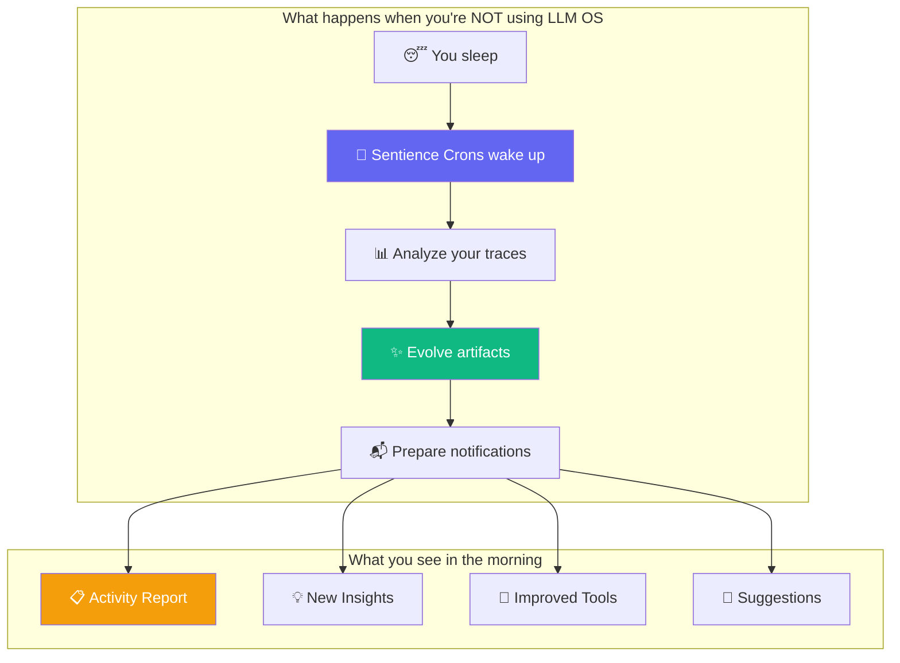
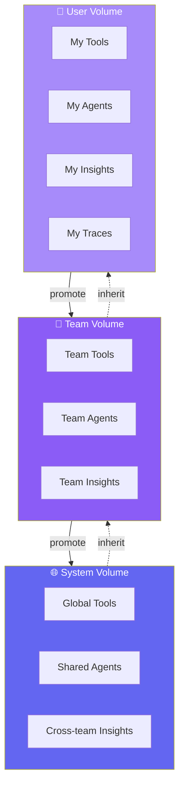
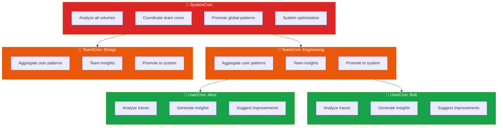
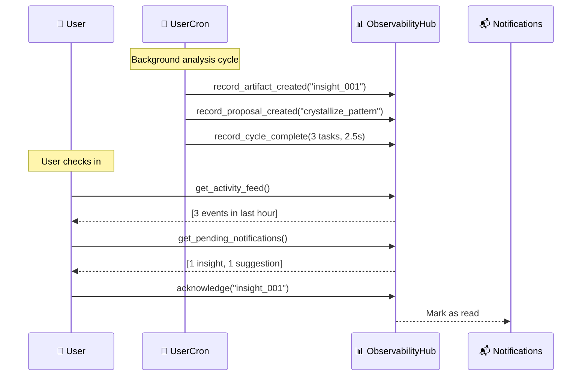
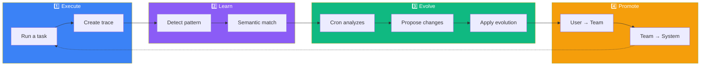
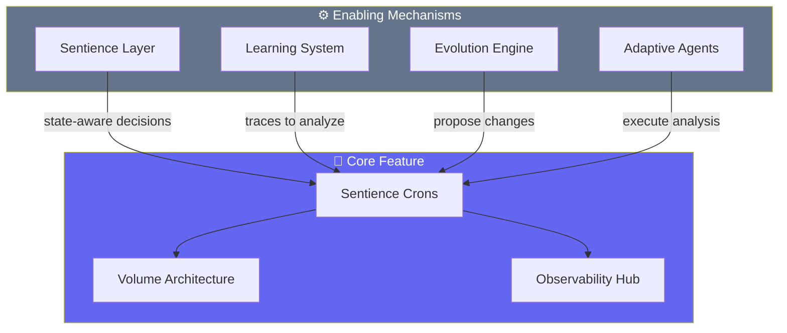

<div align="center">

# LLM OS

### An AI That Learns While You Sleep

[](https://github.com/EvolvingAgentsLabs/llmunix/releases)
[](LICENSE)
[](https://python.org)

**Your AI doesn't just execute tasks. It evolves.**

[The Vision](#the-vision) · [How It Works](#how-it-works) · [Quick Start](#quick-start) · [Architecture](ARCHITECTURE.md)

</div>

---

## The Vision

Imagine an AI system that:

- **Learns from every interaction** and never forgets
- **Works in the background** analyzing and improving itself
- **Shares knowledge** across users, teams, and the entire organization
- **Tells you what it learned** with full transparency

This is LLM OS - an operating system where AI is the CPU, and **living processes** continuously evolve the system's capabilities.



---

## The Core Idea: Living Volumes

At the heart of LLM OS are **Volumes** - organized spaces where your AI's knowledge lives and grows.



**Volumes contain five artifact types:**

| Artifact | What it is | How it evolves |
|----------|------------|----------------|
| **Traces** | Recorded task executions | Summarized, consolidated, crystallized |
| **Tools** | Python functions | Optimized, improved, promoted |
| **Agents** | AI personalities | Refined, enhanced, specialized |
| **Insights** | Discovered patterns | Generated from analysis |
| **Suggestions** | Improvement ideas | Created by crons |

---

## Sentience Crons: The Living Processes

**Sentience Crons** are autonomous background processes that analyze, evolve, and improve your volumes. They're not just scheduled jobs - they're intelligent entities that understand context.



### What Each Cron Does

| Cron | Runs Every | Responsibilities |
|------|------------|------------------|
| **UserCron** | 30 min | Analyze personal traces, detect patterns, suggest crystallization |
| **TeamCron** | 1 hour | Aggregate team patterns, promote successful artifacts |
| **SystemCron** | 2 hours | Global optimization, coordinate all crons, system health |

---

## Full Observability: See Everything

Every action taken by crons is tracked and visible. You're never in the dark about what your AI is doing.



### Observable Events

```python
# Everything is tracked
EventType.CRON_STARTED          # Cron began running
EventType.ARTIFACT_CREATED      # New insight, tool, or agent
EventType.ARTIFACT_EVOLVED      # Existing artifact improved
EventType.ARTIFACT_PROMOTED     # Moved up the hierarchy
EventType.INSIGHT_GENERATED     # Pattern discovered
EventType.SUGGESTION_CREATED    # Improvement opportunity
```

### Query Your AI's Activity

```python
# What happened while I was away?
activity = kernel.get_activity_feed(since_hours=24)

# Any notifications for me?
notifications = kernel.get_cron_notifications()

# What changed in my volume?
changes = kernel.get_artifact_changes(volume_type="user")

# Show me the full report
print(kernel.format_activity_report())
```

---

## The Evolution Journey

When you use LLM OS, your knowledge flows through a continuous evolution cycle:



### A Concrete Example

```
Day 1: You create a Python calculator
       → Trace saved to User Volume

Day 2: You create another calculator
       → UserCron notices: "Pattern detected!"
       → Insight generated: "Calculator tasks are common"

Day 5: Fifth calculator request
       → UserCron proposes: "Crystallize into tool?"
       → Tool created: calc_generator.py
       → Notification: "New tool available!"

Day 10: Your teammate creates a calculator
        → TeamCron notices: "Alice's tool works great"
        → Tool promoted to Team Volume
        → Team notification: "New team tool!"

Day 30: Multiple teams use the tool
        → SystemCron promotes to System Volume
        → Now available to everyone, forever
```

---

## Quick Start

```bash
# Install
git clone https://github.com/EvolvingAgentsLabs/llmunix.git
cd llmunix
pip install -r requirements.txt
export ANTHROPIC_API_KEY="your-key"

# Run
python llmos/boot.py interactive
```

### Start with Crons

```python
from llmos.boot import LLMOS

async def main():
    os = LLMOS()
    await os.boot()

    # Start background evolution for your user
    os.kernel.start_crons(user_id="alice", team_id="engineering")

    # Work normally - crons evolve in the background
    await os.execute("Create a Python calculator")

    # Check what the crons discovered
    notifications = os.kernel.get_cron_notifications()
    for n in notifications:
        print(f"📬 {n['title']}: {n['description']}")

    await os.shutdown()
```

---

## How the Mechanisms Work

The cron and volume system is enabled by several underlying mechanisms:



| Mechanism | What it enables |
|-----------|-----------------|
| **Sentience Layer** | Crons make state-aware decisions (curiosity, safety, energy) |
| **Learning System** | Traces provide the data crons analyze |
| **Evolution Engine** | Proposes how artifacts should change |
| **Adaptive Agents** | Execute the analysis intelligently |

---

## Project Structure

```
llmunix/
├── llmos/kernel/
│   ├── sentience_cron.py    # 🤖 UserCron, TeamCron, SystemCron
│   ├── volumes.py           # 📦 Volume architecture
│   ├── observability.py     # 📊 Event tracking & notifications
│   ├── evolution.py         # ✨ Artifact evolution engine
│   ├── sentience.py         # 🧠 Internal state management
│   └── cognitive_kernel.py  # 🎛️ Coordination layer
├── workspace/
│   └── volumes/             # 📁 Artifact storage
│       ├── users/           #    └── Per-user volumes
│       ├── teams/           #    └── Per-team volumes
│       └── system/          #    └── Global volume
└── examples/
```

---

## Why This Matters

Traditional AI systems are **stateless** - they don't remember, don't learn, don't improve.

LLM OS is **living** - it:

- **Remembers** every successful pattern
- **Learns** from repetition and failure
- **Improves** artifacts continuously
- **Shares** knowledge across boundaries
- **Reports** everything it does

The result: an AI that gets better at helping you, automatically, while you sleep.

---

## Learn More

- **[Architecture Guide](ARCHITECTURE.md)** - Deep dive into all components
- **[Examples](examples/)** - Production-ready implementations

---

<div align="center">

**[Evolving Agents Labs](https://github.com/EvolvingAgentsLabs)**

*Building AI that evolves*

</div>
