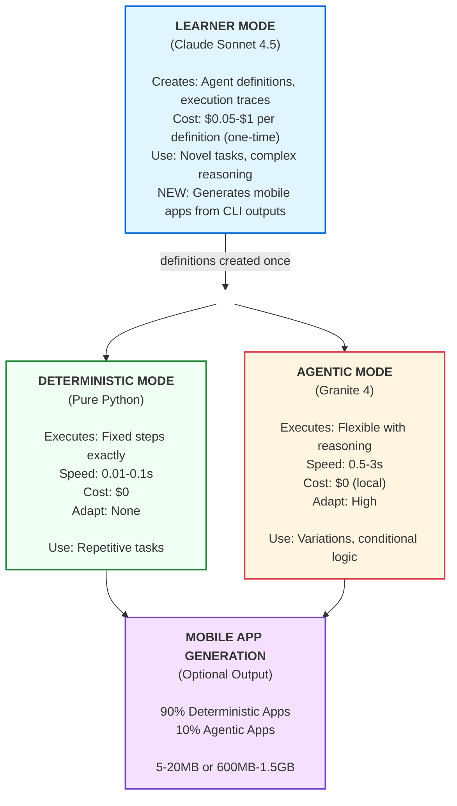
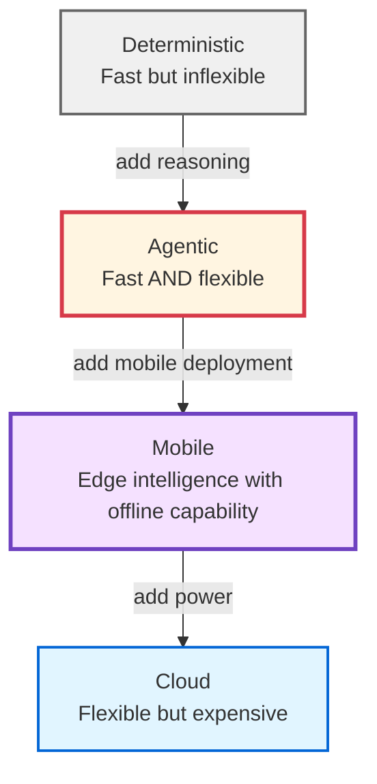

# LLMunix: Pure Markdown Operating System with Agentic Edge AI

> **Transform any LLM into an intelligent operating system. Learn once with Claude, execute infinitely with Granite at zero cost. Generate mobile apps on-demand.**

LLMunix is a revolutionary three-mode AI framework where intelligence is defined in markdown documents. High-powered LLMs create agent definitions, then lightweight edge models execute them with full reasoning capabilities - combining Claude's intelligence with Granite's efficiency. Now with **optional mobile app generation** for edge deployment.

## 🚀 Revolutionary Architecture

### Three Execution Modes + Mobile App Generation



### Why This Matters

**Traditional AI**: $0.50-$5 per execution, requires internet
**LLMunix Agentic**: $0 per execution, offline capable, adapts to variations
**LLMunix Mobile**: Generate production-ready React Native apps from CLI results

**1000 executions**: Save $500-$5000 with agentic mode
**Mobile apps**: Deploy intelligence to edge devices (iOS + Android)

## 🎯 Quick Start

### Prerequisites
- Python 3.11+
- Git
- Ollama (for agentic mode)
- Claude Code (for learner mode and mobile app generation)

### Installation

```bash
# Clone the repository
git clone https://github.com/EvolvingAgentsLabs/llmunix.git
cd llmunix

# Initialize the agent system
./setup_agents.sh    # Mac/Linux
# OR
powershell -ExecutionPolicy Bypass -File .\setup_agents.ps1  # Windows

# Install edge runtime dependencies
cd edge_runtime
pip install -r requirements.txt

# Install Ollama for agentic mode
# macOS/Linux: curl -fsSL https://ollama.ai/install.sh | sh
# Windows: Download from https://ollama.com

# Download Granite models
ollama pull granite4:micro  # 2.1 GB - for simple tasks
# OR
ollama pull granite3.3:8b   # 4.9 GB - for complex tasks

# For mobile app generation (optional)
# Download Qwen or Granite models for on-device AI
ollama pull qwen2.5:0.5b    # 600MB - for agentic mobile apps
```

## 💡 The Four Modes Explained

### Mode 1: Learner (Claude) - Create Once

**Purpose**: Design agent definitions, execution patterns, and mobile apps

```bash
# Boot LLMunix with Claude
claude --dangerously-skip-permissions "boot llmunix"

# Create an agent definition
claude --dangerously-skip-permissions "llmunix execute: 'Create an agent for processing customer data files'"

# Create a mobile app (NEW!)
claude --dangerously-skip-permissions "llmunix execute: 'Create a mobile app for tracking daily habits'"
```

**Output**:
- Agent definition saved to `projects/[project]/components/agents/`
- CLI results in `projects/[project]/output/`
- **Optional**: Mobile app in `projects/[project]/mobile_app/`

**Cost**: $0.50-$1.00 one-time
**Value**: Reusable forever

---

### Mode 2: Deterministic Follower - Execute Fast

**Purpose**: Repeat identical tasks at maximum speed

```bash
# Execute pre-defined trace
python edge_runtime/run_follower.py \
  --trace memory/long_term/execution_trace_greeting_v1.0.md \
  --base-dir projects/Project_example
```

**Speed**: 0.01-0.1 seconds
**Cost**: $0
**Flexibility**: None (exact steps only)

**Best For**:
- Daily backups
- Fixed report generation
- Repetitive data processing

---

### Mode 3: Agentic Follower (Granite) - Execute Smart 🚀

**Purpose**: Adaptive execution with reasoning

```bash
# Execute with agentic reasoning
python edge_runtime/run_agentic_follower.py \
  --agent components/agents/FileProcessorAgent.md \
  --goal "Process today's sales data and create summary" \
  --base-dir projects/Project_sales \
  --model granite4:micro
```

**What Granite Does**:
1. Reads agent definition (capabilities, constraints, guidelines)
2. Interprets the goal
3. **Reasons about approach** (not hardcoded!)
4. Calls tools adaptively (Read, Write, Bash)
5. Handles variations and edge cases
6. Generates results

**Speed**: 0.5-3 seconds
**Cost**: $0 (local Ollama)
**Flexibility**: High (adapts to variations)

**Best For**:
- Files with varying formats
- Tasks requiring conditional logic
- Workflows needing error recovery
- Scenarios with edge cases

---

### Mode 4: Mobile App Generation (NEW!) 📱

**Purpose**: Generate production-ready mobile apps from CLI results

```bash
# Generate mobile app
claude "llmunix execute: 'Create a mobile app for habit tracking'"
```

**What Happens**:
1. **Primary Execution**: CLI workflow generates requirements, analysis, design
2. **Mobile Detection**: SystemAgent detects "mobile app" keyword
3. **Code Generation**: CodeGeneratorAgent creates React Native codebase
4. **Classification**: MobileAppAnalyzer determines if LLM is needed
   - **Deterministic (90%)**: Code-only, 5-20MB
   - **Agentic (10%)**: Code + on-device LLM, 600MB-1.5GB
5. **Bundling**: MobileAppBuilder creates deployment package
6. **Output**: Complete React Native app ready for iOS/Android

**Classification Examples**:

**Deterministic Apps (No LLM):**
- Habit tracker, calculator, news reader
- Data visualization, CRUD operations
- Rule-based logic only
- **Size**: 5-20MB

**Agentic Apps (With LLM):**
- Personal trainer (adapts workouts)
- Study assistant (generates quizzes)
- Code helper (suggests improvements)
- **Size**: 600MB-1.5GB (includes Qwen3-0.6B or Granite 4.0 H-1B)

**Output Structure**:
```
projects/Project_habit_tracker/
├── output/              # Primary CLI results
│   ├── requirements.md
│   ├── data_model.md
│   └── features.md
└── mobile_app/          # Optional mobile app
    ├── manifest.json
    ├── package.json
    ├── src/
    │   ├── screens/
    │   ├── components/
    │   └── services/
    ├── models/          # Only if agentic
    │   └── qwen3-0.6b-int4.gguf
    └── README.md
```

---

## 🌟 Real-World Example: Daily Sales Processing

### Traditional Approach (Expensive)
```bash
# Every day: Call Claude API
# Cost: $2 × 365 days = $730/year
claude "Process today's sales data"
```

### LLMunix Agentic Approach (Smart)

**Step 1: Create Agent Once (Learner)**
```bash
claude "Create agent for processing sales data files"
```
Output: `SalesProcessorAgent.md` with:
- Capabilities: read CSV, analyze data, generate reports
- Constraints: <10MB files, .csv/.xlsx formats
- Guidelines: "Validate → Analyze → Report"
- Error handling: retry on network errors, skip invalid records

Cost: $0.50 (one-time)

**Step 2: Execute Daily (Agentic)**
```bash
# Day 1: sales_2024_11_04.csv
python edge_runtime/run_agentic_follower.py \
  --agent SalesProcessorAgent.md \
  --goal "Process today's sales file"

# Granite reasons: "I see sales_2024_11_04.csv, I'll read it, analyze, generate report"
```

```bash
# Day 2: sales_nov_5.csv (different naming!)
# Granite adapts: "Filename changed but it's still CSV sales data, I'll process it"
```

```bash
# Day 3: sales_data.xlsx (different format!)
# Granite handles: "Excel format detected, I'll adjust my approach"
```

**Cost**: $0.50 setup + $0 × 365 executions = **$0.50/year**
**Savings**: $729.50/year vs traditional approach
**Added Value**: Adapts to file naming changes, format variations, missing data

---

## 📱 Mobile App Generation Examples

### Example 1: Habit Tracker (Deterministic)

```bash
claude "llmunix execute: 'Create a mobile app for tracking daily habits'"
```

**Generated**:
- **CLI Output**: requirements.md, data_model.md, features.md
- **Mobile App**: React Native app (15MB)
  - Dashboard screen with habit list
  - Analytics screen with charts
  - Settings screen
  - AsyncStorage for data persistence
  - **No LLM** (all logic is rule-based)

**Classification**: Deterministic
**Reason**: CRUD operations, charts, reminders - no AI needed

---

### Example 2: Personal Trainer (Agentic)

```bash
claude "llmunix execute: 'Build a mobile personal trainer app that adapts workouts to my progress'"
```

**Generated**:
- **CLI Output**: workout_system.md, training_plan.md
- **Mobile App**: React Native app (635MB)
  - Workout tracking screens
  - Progress analytics
  - Settings and preferences
  - **Qwen3-0.6B LLM** bundled (600MB)
  - AI service for workout generation

**Classification**: Agentic
**Reason**: Generates personalized workout plans, adapts to user progress
**LLM Features**:
- `generateWorkoutPlan(userProfile)` - adaptive routines
- `provideFeedback(exerciseDescription)` - form corrections
- `answerQuestions(query)` - conversational trainer

---

### Example 3: Study Assistant (Agentic with Code Focus)

```bash
claude "llmunix execute: 'Create a mobile study assistant that generates quiz questions and explains concepts'"
```

**Generated**:
- **CLI Output**: study_methodology.md, quiz_generator.md
- **Mobile App**: React Native app (1.54GB)
  - Study session tracker
  - Quiz interface
  - Concept explanations
  - **Granite 4.0 H-1B LLM** bundled (1.5GB)
  - Superior code generation for STEM topics

**Classification**: Agentic
**Reason**: Generates educational content, explanations, code examples
**Model Choice**: Granite 4.0 H-1B (73.0 HumanEval, 82.37 IFEval)
**Best For**: Code generation, structured output, instruction following

---

## 🛠️ What Can You Build?

### Intelligent File Processing
```python
# Agent adapts to variations automatically
run_agentic_follower.py \
  --agent FileProcessorAgent.md \
  --goal "Process all customer data files in input/"

# Handles:
# - Different CSV structures
# - Missing columns
# - Varying data quality
# - Multiple formats (.csv, .xlsx, .json)
```

### Mobile Apps On-Demand
```bash
# CLI-only (default)
claude "llmunix execute: 'Analyze fitness tracking requirements'"

# CLI + Deterministic mobile app
claude "llmunix execute: 'Create a mobile app for fitness tracking'"

# CLI + Agentic mobile app
claude "llmunix execute: 'Create an AI workout coach mobile app'"
```

### Research & Analysis with Flexibility
```python
# Agent adjusts extraction based on content
run_agentic_follower.py \
  --agent ResearchAgent.md \
  --goal "Extract key findings from research papers"

# Adapts to:
# - Different paper structures
# - Various academic formats
# - Multiple languages
# - Incomplete data
```

---

## 📊 Performance Comparison

### Cost Analysis (1000 Executions)

| Mode | Setup | Per-Run | Total | Flexibility |
|------|-------|---------|-------|-------------|
| **Cloud (Claude)** | $0 | $2.00 | **$2,000** | ⭐⭐⭐⭐⭐ |
| **Agentic (Granite)** | $0.50 | $0 | **$0.50** | ⭐⭐⭐⭐ |
| **Deterministic** | $0.50 | $0 | **$0.50** | ⭐ |

**Savings**: $1,999.50 with agentic mode!

### Mobile App Comparison

| Type | Generation Cost | App Size | Features | Examples |
|------|----------------|----------|----------|----------|
| **Deterministic** | $0.50 | 5-20MB | CRUD, Charts, Offline | Habit tracker, Calculator |
| **Agentic (Qwen)** | $0.50 | 635MB | AI reasoning, Multilingual | Personal trainer, Language tutor |
| **Agentic (Granite)** | $0.50 | 1.54GB | Code generation, STEM | Study assistant, Code helper |

**One-time generation, deploy forever!**

### Speed Comparison

| Mode | Execution Time | Latency |
|------|---------------|---------|
| **Deterministic** | 0.01-0.1s | None |
| **Agentic (Granite)** | 0.5-3s | Local LLM |
| **Cloud (Claude)** | 10-30s | Network + LLM |
| **Mobile App (Deterministic)** | Instant | None |
| **Mobile App (Agentic)** | 1-2s | On-device LLM |

---

## 🏗️ Framework Architecture

```
llmunix/
├── system/
│   ├── agents/
│   │   ├── SystemAgent.md              # Orchestration + mobile detection
│   │   ├── CodeGeneratorAgent.md       # 🆕 React Native generation
│   │   └── MemoryAnalysisAgent.md      # Learning
│   ├── tools/
│   │   ├── MobileAppAnalyzer.md        # 🆕 Agentic vs deterministic
│   │   ├── MobileAppBuilder.md         # 🆕 App bundling
│   │   └── ClaudeCodeToolMap.md        # Tool integration
│   ├── SmartLibrary.md                 # Component registry
│   └── memory_log.md                   # Experience database
│
├── edge_runtime/
│   ├── run_follower.py                 # Deterministic execution
│   ├── run_agentic_follower.py         # LLM-powered execution
│   └── requirements.txt                # ollama, pyyaml
│
├── projects/                           # Your projects created here
│   └── [Auto-created on execution]     # Projects created dynamically
│       ├── components/
│       │   ├── agents/                 # Project agents
│       │   └── tools/                  # Project tools
│       ├── input/                      # Input documents
│       ├── output/                     # CLI results
│       ├── mobile_app/                 # Optional mobile app
│       │   ├── manifest.json
│       │   ├── src/
│       │   └── README.md
│       └── memory/
│           ├── short_term/             # High-frequency memory
│           └── long_term/              # Consolidated patterns
│
├── .claude/agents/                     # Auto-discovered agents
└── CLAUDE.md                          # Framework documentation
```

---

## 🎓 Example: Create Your First Project

Generate a complete project with mobile app in one command:

```bash
claude --dangerously-skip-permissions "llmunix execute: 'Create a mobile app for tracking daily habits'"
```

**What happens**:
1. **Project created**: `projects/Project_habit_tracker/`
2. **CLI workflow**: Requirements analysis, data model, features → `output/`
3. **Mobile app**: Complete React Native codebase → `mobile_app/`
4. **Classification**: Deterministic (no LLM, 15MB) or Agentic (with LLM, 600MB+)

**Result**: Production-ready mobile app from a single command!

---

## 🤝 Creating Agentic Agents

### Step 1: Define Agent (Learner Mode)

```bash
claude "Create an agent for processing medical records with HIPAA compliance"
```

**Generated**: `MedicalRecordsAgent.md`
```markdown
---
agent_id: medical-records-processor
version: "1.0"
execution_mode: agentic_with_llm

capabilities:
  file_operations: [read_pdf, read_csv, write_encrypted]
  data_processing: [anonymize, validate_hipaa, extract_codes]
  compliance: [audit_log, encryption, access_control]

constraints:
  max_file_size_mb: 100
  allowed_formats: [pdf, csv, hl7]
  encryption_required: true
  audit_required: true

reasoning_guidelines: |
  HIPAA Compliance Priority:
  1. Verify file encryption before processing
  2. Anonymize all PII (names, SSN, addresses)
  3. Extract medical codes (ICD-10, CPT)
  4. Validate data completeness
  5. If encryption missing, reject with error
  6. Log all access to audit trail
  7. Generate compliance report

error_handling: |
  - Missing PHI: Flag and continue with available data
  - Invalid format: Attempt format detection
  - Encryption failure: HALT and alert (critical)
  - Validation errors: Log and quarantine record
---
```

### Step 2: Execute with Agentic Follower

```bash
python edge_runtime/run_agentic_follower.py \
  --agent MedicalRecordsAgent.md \
  --goal "Process today's medical records batch" \
  --model granite3.3:8b \
  --base-dir projects/Project_healthcare
```

---

## 📚 Mode Selection Guide

### Choose **Deterministic Mode** When:

✅ Task is **identical every time**
✅ **Maximum speed** required (sub-second)
✅ **Zero variability** acceptable
✅ Simple tool sequences

**Example**: Nightly database backup

---

### Choose **Agentic Mode (Granite)** When:

✅ Task has **variations** (file formats, structures, content)
✅ Need **conditional logic** ("if X then Y")
✅ **Error recovery** important
✅ Can afford **1-3 seconds** execution time
✅ Want **offline capability** (edge devices)

**Example**: Daily data processing with varying formats

---

### Choose **Mobile App Generation** When:

✅ Need **edge deployment** (iOS/Android)
✅ Want **offline mobile intelligence**
✅ Building **personal/local apps**
✅ Privacy-first requirements (no cloud dependency)

**Deterministic Apps**: Habit trackers, calculators, dashboards, CRUD apps
**Agentic Apps**: Personal trainers, study assistants, conversational apps

---

## 🚀 Advanced Features

### Mobile App Model Selection

**Qwen3-0.6B-INT4 (Primary Choice)**:
- **Use When**: General agentic apps, conversational AI, multilingual
- **Size**: 600MB
- **Quality**: 52.81 MMLU
- **Speed**: 50-150 tokens/sec (CPU), 200-500 tokens/sec (NPU)
- **License**: Apache 2.0

**Granite 4.0 H-1B-INT4 (Alternative)**:
- **Use When**: Code generation, structured output, STEM education
- **Size**: 1.5GB
- **Quality**: 73.0 HumanEval, 82.37 IFEval
- **Speed**: 30-80 tokens/sec (CPU)
- **License**: Apache 2.0

**Selection automatically handled by MobileAppAnalyzer**

### Hybrid Workflows

Combine modes for optimal results:

```bash
# 1. Learner creates definition (once)
claude "Create invoice processing agent"

# 2. Agentic mode handles variations (daily)
python run_agentic_follower.py \
  --agent InvoiceProcessorAgent.md \
  --goal "Process today's invoices"

# 3. Deterministic mode for known formats (batch)
python run_follower.py \
  --trace standard_invoice_trace.md

# 4. Mobile app for field workers
claude "Create a mobile app for invoice scanning and processing"
```

### Multi-Model Strategy

```bash
# Simple tasks: Granite 4:micro (2.1 GB, fast)
--model granite4:micro

# Complex tasks: Granite 3.3:8b (4.9 GB, smarter)
--model granite3.3:8b

# Maximum quality: Claude (cloud, expensive)
claude "llmunix execute: ..."

# Mobile agentic: Qwen 0.5b or Granite 4.0 H-1B (automatic selection)
```

---

## 💾 Installation Details

### Full Setup

```bash
# 1. Clone repository
git clone https://github.com/EvolvingAgentsLabs/llmunix.git
cd llmunix

# 2. Initialize agents
./setup_agents.sh  # or setup_agents.ps1 on Windows

# 3. Install Python dependencies
cd edge_runtime
pip install -r requirements.txt

# 4. Install Ollama
# macOS/Linux:
curl -fsSL https://ollama.ai/install.sh | sh

# Windows: Download from https://ollama.com/download

# 5. Download Granite models
ollama pull granite4:micro      # 2.1 GB - Simple tasks
ollama pull granite3.3:8b       # 4.9 GB - Complex tasks

# 6. For mobile app generation (optional)
ollama pull qwen2.5:0.5b        # 600MB - Mobile agentic apps

# 7. Verify installation
python run_agentic_follower.py --help
```

---

## 📖 Complete Documentation

- **CLAUDE.md** - Complete framework documentation with Continuum Memory System and mobile app generation
- **EXAMPLES.md** - Comprehensive examples for all modes
- **system/SmartLibrary.md** - Complete component registry
- **system/infrastructure/memory_schema.md** - Nested Learning-based memory architecture

---

## 🎯 Why LLMunix?

### Traditional AI Limitations
- ❌ $0.50-$5 per execution (expensive at scale)
- ❌ Requires internet connectivity
- ❌ No edge deployment
- ❌ Privacy concerns (data leaves premises)
- ❌ Can't adapt without reprogramming
- ❌ No mobile app generation

### LLMunix Advantages
- ✅ **$0 per execution** (after setup)
- ✅ **Offline capable** (edge devices)
- ✅ **Adapts to variations** (agentic reasoning)
- ✅ **Privacy-preserving** (all local)
- ✅ **Learn once, execute infinitely**
- ✅ **Generate mobile apps on-demand** (NEW!)
- ✅ **90% deterministic optimization** (small, fast apps)
- ✅ **10% agentic intelligence** (when AI is needed)

### The Sweet Spot: Agentic Mode + Mobile



**Agentic mode gives you 80% of cloud flexibility at 0% of the cost!**
**Mobile generation deploys that intelligence to edge devices!**

---

## 🤔 Getting Help

- **Documentation**: See `EXAMPLES.md`, `CLAUDE.md`
- **Issues**: [GitHub Issues](https://github.com/EvolvingAgentsLabs/llmunix/issues)
- **Research**: See `system/SmartLibrary.md` for model selection details
- **Memory System**: See `system/infrastructure/memory_schema.md` for CMS architecture

---

## 📄 License

Apache License 2.0 - see LICENSE file for details

---

## 🌟 Key Innovation

**LLMunix is the first framework to combine:**

1. **High-quality agent definitions** (from Claude)
2. **Low-cost flexible execution** (with Granite)
3. **Zero marginal cost** (local Ollama)
4. **True edge intelligence** (offline capable)
5. **Mobile app generation** (React Native + on-device LLMs) 🆕
6. **Intelligent app classification** (90% lightweight, 10% AI-powered) 🆕

**Result**: Intelligent, adaptive AI at commodity hardware costs, now deployable to mobile devices.

---

*Built with ❤️ by [Evolving Agents Labs](https://evolvingagentslabs.github.io)*

**Start building intelligent edge AI today - from CLI to mobile!**
