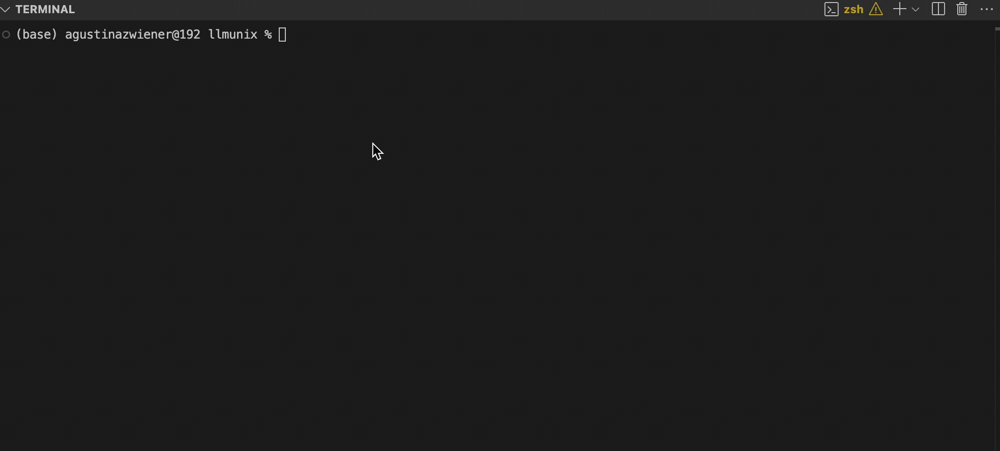

# LLMunix 🦄

**The Pure Markdown Operating System with Dual Runtime Support**

LLMunix turns AI models into autonomous agents using a pure markdown architecture. Run the exact same system on either Claude Code or Gemini CLI based on your preference and needs.

> 🌐 **Part of [Evolving Agents Labs](https://evolvingagentslabs.github.io)** | 🔬 [View All Experiments](https://evolvingagentslabs.github.io#experiments) | 📖 [Project Details](https://evolvingagentslabs.github.io/experiments/llmunix.html)

## Choose Your Runtime:

### [Claude Code](https://anthropic.com/claude-code)
* Ready to use with Claude's powerful built-in tools
* Excellent for production and complex workflows
* Fast setup with minimal configuration

### [Gemini CLI](https://github.com/google-gemini/gemini-cli)
* Requires the enhanced version with virtual tools support
* Clone: `git clone https://github.com/EvolvingAgentsLabs/gemini-cli -b issue-1806`
* Build following the repo instructions
* Great for local development and customization

## Core Concepts

LLMunix implements **Adaptive Behavior Management** - the system's behavior dynamically adapts through evolving constraints. The framework features a well-organized structure with core components in the system folder and specialized components in the components folder.

-   **Pure Markdown Architecture**: All system components—sub-agents and tools—are human-readable Markdown files with YAML frontmatter.
-   **Manifest-Driven**: The OS "firmware" and "system calls" are defined in either `CLAUDE.md` for Claude Code or `GEMINI.md` for Gemini CLI.
-   **Multi-Tier Memory System**: Three memory levels for different persistence needs:
    -   **Volatile Memory**: Temporary data for current execution
    -   **Task Memory**: Information relevant to the current goal
    -   **Permanent Memory**: Long-term learnings that persist across sessions
-   **Sub-Agent Architecture**: The SystemAgent orchestrates specialized sub-agents:
    -   **Context Isolation**: Each sub-agent runs in its own context window
    -   **Tool Access Control**: Sub-agents have controlled access to specific tools
    -   **State Sharing**: Sub-agents share state through workspace files
-   **Dynamic Evolution**: The SystemAgent can write new sub-agent files to create new capabilities on the fly.
-   **Dual Runtime Support**: Run on either Claude Code or Gemini CLI with the same codebase through runtime-specific manifest files.

---

## Getting Started

LLMunix supports two AI runtimes: Claude Code and Gemini CLI. Choose the one that best fits your needs and follow the instructions below.

### Prerequisites

- **For Claude Code**: You need [Claude Code](https://anthropic.com/claude-code) installed
- **For Gemini CLI**: You need the enhanced version with virtual tools support:
  - Clone: `git clone https://github.com/EvolvingAgentsLabs/gemini-cli -b issue-1806`
  - Build: Follow instructions in the README of that repository

### Installation

```bash
# Clone the LLMunix repository
git clone https://github.com/EvolvingAgentsLabs/llmunix.git
cd llmunix
```

## Running LLMunix with Claude Code

### 1. Boot the System

This initializes the workspace and prepares the environment.

```bash
# From the llmunix project root directory:
boot llmunix
```

You'll see the ASCII art welcome message and example commands.

### 2. Execute a Task

Use the `llmunix execute:` command followed by your goal in quotes:

```bash
# Basic execution
llmunix execute: "Monitor 5 tech news sources, extract trending topics, and generate an intelligence briefing."

# Research task example
llmunix execute: "Get live content from https://huggingface.co/blog and create a research summary"

# Interactive mode (with user involvement)
llmunix execute: "Create a Python calculator" -i
```

Claude Code reads the `CLAUDE.md` manifest and executes your goal autonomously.

### 3. Other Commands

```bash
# Interactive session
./llmunix-llm interactive

# Simulate a task (for training data generation)
llmunix simulate: "Research task workflow for fine-tuning dataset"
```

## Running LLMunix with Gemini CLI

### 1. Boot the System

This script prepares the workspace for execution. Run it once per session:

```bash
# From the llmunix project root:
./llmunix-boot
```

### 2. Start Gemini CLI

Start the enhanced Gemini CLI from your terminal:

```bash
# If using the compiled version from EvolvingAgentsLabs fork:
/path/to/gemini
```

### 3. Execute a Task

Simply type your goal at the Gemini CLI prompt:

```
> Monitor 5 tech news sources, extract trending topics, and generate an intelligence briefing.
```

Or for a research task:

```
> Get live content from https://huggingface.co/blog and create a research summary
```

Gemini CLI reads the `GEMINI.md` manifest and executes your goal autonomously.

### 4. Interactive Commands

During an interactive session, you can use these commands:

```
🎯 llmunix> refine     # Refine the last executed goal
🎯 llmunix> status     # Show current workspace status
🎯 llmunix> history    # Display execution history
🎯 llmunix> clear      # Reset workspace (with confirmation)
🎯 llmunix> help       # Show available commands
🎯 llmunix> exit       # Exit interactive mode
```

## Example Use Cases & Commands

### Real-World Examples

Here are practical examples of tasks you can ask LLMunix to perform:

#### Research and Analysis

```bash
# Claude Code
llmunix execute: "Monitor 5 tech news sources (TechCrunch, Ars Technica, Hacker News, MIT Tech Review, Wired), extract trending topics, identify patterns, and generate a weekly intelligence briefing"

# Gemini CLI
> Monitor 5 tech news sources (TechCrunch, Ars Technica, Hacker News, MIT Tech Review, Wired), extract trending topics, identify patterns, and generate a weekly intelligence briefing
```

#### Content Creation

```bash
# Claude Code
llmunix execute: "Create a marketing campaign for EcoFlow Pro battery system with 5 social media posts, competitive analysis, and customer persona"

# Gemini CLI
> Create a marketing campaign for EcoFlow Pro battery system with 5 social media posts, competitive analysis, and customer persona
```

#### Web Research

```bash
# Claude Code
llmunix execute: "Get live content from https://huggingface.co/blog and create a research summary"

# Gemini CLI
> Get live content from https://huggingface.co/blog and create a research summary
```

#### Training Data Generation

```bash
# Claude Code
llmunix simulate: "Research task workflow for fine-tuning dataset"

# Gemini CLI
> Simulate a research task workflow for fine-tuning dataset
```

---

## The Power of Manifest-Driven Virtual Tools

LLMunix leverages a revolutionary **manifest-driven virtual tool system** that transforms how AI assistants interact with project-specific functionality:

### Key Innovation: Virtual Tools in Markdown

The manifest file (`CLAUDE.md` or `GEMINI.md`) can define custom tools using a simple format:

```markdown
#### tool_name
`sh`
```sh
#!/bin/bash
# Shell script implementation
```
`json`
```json
{
  "name": "tool_name",
  "description": "Tool description",
  "parameters": { /* JSON Schema */ }
}
```
```

These virtual tools are:
- **Discovered dynamically** at runtime
- **Executed in a secure sandbox**
- **Immediately available** without compilation
- **Version-controlled** alongside your project

### Example: Integrating External LLMs

LLMunix includes a `LocalLLMTool` that enables delegation to local LLMs via Ollama:

```bash
# The agent can now consult other AI models:
> Please analyze the following code snippet for potential bugs. 
> First, get a second opinion from the llama3.2 model, then provide your final analysis.
```

This demonstrates how virtual tools enable:
- **Multi-model workflows** - Different LLMs for different tasks
- **Local computation** - Sensitive data stays on-premise
- **API integration** - Connect to any service via HTTP

## LLMunix in Action: How It Works

LLMunix turns AI runtimes into autonomous agents that can solve complex problems. Here's how it works in practice:

### Example Task Execution

When given the task: *"Monitor 5 tech news sources, extract trending topics, and generate an intelligence briefing"*

The agent follows this execution flow:

1. **Planning Phase**
   * Creates detailed execution plan in `workspace/state/plan.md`
   * Identifies required resources and tools
   * Establishes success criteria and fallback strategies

2. **Adaptive Error Handling**
   * When `GoogleSearch` tool fails due to API errors
   * Recovers by creating its own list of reliable sources
   * Saves alternative approach to `workspace/state/tech_news_sources.md`

3. **Dynamic Capability Evolution**
   * Recognizes need for specialized tools not yet available
   * Generates new agent definitions like `TrendingTopicExtractorAgent.md`
   * Creates `IntelligenceBriefingAgent.md` with specialized analysis logic
   * Writes these new components to `components/agents/` for future reuse

4. **Resilient Task Completion**
   * Even when facing tool execution errors
   * Falls back to manual implementation of agent logic
   * Uses created agent definitions as execution templates
   * Adapts approach based on current execution context

5. **Final Delivery**
   * Successfully extracts trending topics across sources
   * Synthesizes comprehensive intelligence briefing
   * Writes final output to `intelligence_briefing.md`
   * Completes goal despite obstacles encountered

This entire execution sequence demonstrates LLMunix's power: planning, error recovery, capability evolution, and resilience - all fully autonomous and driven by markdown-based instructions.



### Core Architecture

The architecture is designed to enable this emergent, intelligent behavior. LLMunix features a dual-runtime design with a clear separation between core system components and specialized tools/agents.

```
llmunix/
├── llmunix-boot         # The deterministic boot script.
├── CLAUDE.md            # Claude Code manifest: OS firmware for Claude runtime.
├── GEMINI.md            # Gemini manifest: OS firmware for Gemini CLI runtime.
├── components/          # A library of pre-built, reusable agents and tools.
│   ├── agents/          # Specialized/domain-specific agents
│   └── tools/           # Specialized/domain-specific tools
├── system/              # Core system files and components.
│   ├── agents/          # Core system agents (SystemAgent, MemoryAnalysisAgent)
│   ├── tools/           # Core system tools (ClaudeCodeToolMap, QueryMemoryTool)
│   └── memory_log.md    # Structured, queryable experience database
└── workspace/           # Ephemeral working directory for a single run.
    └── state/           # The agent's live memory and state.
```

**Component Organization:**
- **Core System Components**: Essential components that power the LLMunix framework itself are in `system/agents/` and `system/tools/`
- **Specialized Components**: Domain-specific and reusable components for various tasks in `components/agents/` and `components/tools/`

## Enhanced Architecture: Memory & Messaging

### Multi-Tier Memory System

LLMunix implements a sophisticated three-tier memory architecture that enables agents to learn and improve over time:

```
workspace/memory/
├── volatile/       # Cleared each session - temporary data
├── task/          # Persists for current goal - working context
└── permanent/     # Located in system/memory/permanent/ - long-term learning
```

**Memory Operations:**
- `memory_store(type, key, value)` - Store information with timestamp
  - **volatile**: For temporary calculations, fetched data, intermediate results
  - **task**: For context about the current goal, plans, decisions
  - **permanent**: For learnings, patterns, and insights to retain
- `memory_recall(type, key)` - Retrieve specific memories by key
- `memory_search(pattern)` - Full-text search across memory tiers

**Implementation Details:**
- Each memory entry is stored as a Markdown file with timestamps
- Volatile and task memories are stored per-session in workspace
- Permanent memories persist in the system directory across sessions
- The `memory_search` tool uses grep to find patterns across all tiers

### Agent Communication System

Agents communicate through an asynchronous message-passing system that enables complex multi-agent workflows:

```
workspace/messages/
├── inbox/         # Per-agent message queues
│   └── AgentName/
│       └── msg_[timestamp]_[sender].md
├── bulletins/     # Broadcast messages by topic
└── read/          # Processed messages archive
```

**Messaging Tools:**
- `send_message(to, message, priority, from)` - Direct agent-to-agent communication
  - Priority levels: urgent > high > normal > low
  - Messages include metadata: sender, timestamp, priority
- `check_messages(agent, priority, mark_read)` - Check inbox with filters
  - Can filter by priority level
  - Option to mark messages as read
- `broadcast_message(message, topic)` - System-wide announcements
  - Posted to bulletin boards by topic
  - All agents can subscribe to topics

**Message Format:**
```markdown
---
from: SenderAgent
to: RecipientAgent
timestamp: 1234567890
time: 2025-07-05 12:34:56
priority: normal
---

Message content here...
```

### How Memory & Messaging Work Together

The EcoFlow Pro campaign execution demonstrates the synergy:

1. **Memory Evolution**: Agents store market insights in permanent memory for future campaigns
2. **Contextual Communication**: Messages reference shared memories and past analyses
3. **Learning from Errors**: Failed tool executions are logged for improvement
4. **Collaborative Intelligence**: Agents build on each other's work through messages

### Virtual Company Demo

See the power of memory and messaging in action with our Virtual Company example:
- **CEO, Analyst, Writer, and QA agents** collaborate autonomously
- **Market insights** are stored permanently for future reference
- **Task coordination** happens through priority-based messaging
- **Quality feedback** loops ensure continuous improvement
- Located in `examples/virtual_company_demo.md`

## Technical Architecture

### Dual Runtime Architecture

LLMunix is designed to work with multiple AI runtimes through a unified component architecture:

1. **Runtime-Specific Manifests**: 
   - `CLAUDE.md` - Configuration optimized for Claude Code
   - `GEMINI.md` - Configuration optimized for Gemini CLI

2. **Shared Component Library**:
   - Both runtimes use the same system components and tools
   - Runtime-specific behavior is isolated to manifest files

3. **Unified Tool Integration**:
   - Components map to native tools for each runtime
   - Same components work across different AI systems
   - Consistent API across runtimes

### Virtual Tool Execution Flow

1. **Discovery**: On startup, the runtime parses the manifest file (`CLAUDE.md` or `GEMINI.md`) and any component files
2. **Registration**: Each tool definition creates a callable function in the AI's context
3. **Invocation**: When the AI calls a tool, the shell script executes with arguments passed via `$GEMINI_TOOL_ARGS`
4. **Sandboxing**: All execution happens within the runtime's security boundaries
5. **Response**: The script's stdout is returned to the AI as the tool result

### Security & Isolation

- **Directory restrictions**: Tools can enforce path-based access control
- **Sandboxed execution**: Shell scripts run in the runtime's secure environment
- **No compilation**: Pure text files eliminate binary vulnerabilities
- **Auditable**: All tool logic is human-readable Markdown

### Comparison with Traditional Approaches

| Aspect | Traditional SDK/Plugin | LLMunix Virtual Tools |
|--------|----------------------|----------------------|
| Definition | Compiled code | Markdown + Shell |
| Deployment | Build & install | Write & save |
| Debugging | IDE/Debugger | Read the Markdown |
| Sharing | Package manager | Copy the file |
| Security | Binary analysis | Text inspection |

## Real-World Applications

The enhanced memory and messaging systems enable:

### Business Process Automation
- Virtual companies with specialized agent roles
- Automated report generation with quality control
- Market research and competitive analysis
- Content creation pipelines

### Collaborative Intelligence
- Multiple agents working on complex problems
- Peer review and feedback loops
- Knowledge accumulation over time
- Consensus building through message exchanges

### Adaptive Systems
- Learning from past executions
- Improving performance through memory
- Context-aware decision making
- Self-organizing agent hierarchies

## Runtime Support: Claude Code vs Gemini CLI

LLMunix offers a flexible dual-runtime architecture that lets you choose the AI model that best fits your needs. The same codebase works seamlessly with either runtime, thanks to the manifest-driven approach.

### Claude Code Runtime

**Key Features:**

- **Native Sub-Agent Architecture**: Leverage Claude's powerful sub-agent system
  - **Isolated Context**: Each sub-agent runs in its own context window
  - **Specialized Tools**: Sub-agents can have limited tool access
  - **Dynamic Discovery**: New sub-agents can be created and used on the fly

- **Production-Ready Tools**: Leverage Claude's robust built-in tools
  - `WebFetch`: Direct web content access with smart processing
  - `Read/Write/Edit`: Complete file system management
  - `Glob/Grep`: Powerful pattern matching and search
  - `Bash/Task`: System command execution and sub-agent delegation

- **Developer Experience:**
  - Seamless integration with Claude Code CLI
  - Comprehensive error handling and debugging
  - High-quality responses with Claude's reasoning capabilities

- **Ideal For:**
  - Production environments requiring stability
  - Complex research tasks needing web access
  - Projects requiring advanced file management

### Gemini CLI Runtime

**Key Features:**

- **Virtual Tool System:**
  - Custom tools defined in markdown files
  - Secure sandboxed execution environment
  - Dynamic tool discovery without compilation

- **Developer Experience:**
  - More flexible deployment options
  - Easy customization of tooling
  - Simpler setup process for local development

- **Ideal For:**
  - Local development environments
  - Custom toolchain integration
  - Edge computing scenarios

### Benefits of Dual Runtime Support

1. **AI Model Choice**: Select the language model that best fits your specific use case
2. **Task-Specific Models**: Use different models for different types of tasks
3. **Deployment Options**: Run locally or in cloud environments based on your needs
4. **Future Compatibility**: Architecture designed to support additional AI runtimes
5. **Consistent Experience**: Same markdown components work across all supported runtimes

## Future Potential

The manifest-driven approach enables:

1. **Marketplace of Tools**: Share tools as simple Markdown files
2. **Cross-Project Learning**: AI can adapt successful patterns
3. **Regulatory Compliance**: Auditable, version-controlled AI behavior
4. **Edge Computing**: Run sophisticated AI workflows locally
5. **Custom Domains**: Medical, legal, finance-specific tool libraries

## Acknowledgements

*   **Original Concept & Research**: [Matias Molinas](https://github.com/matiasmolinas) and [Ismael Faro](https://github.com/ismaelfaro).
*   **Manifest-Driven Virtual Tools**: Implemented in Claude Code natively and proposed in [Gemini CLI Issue #1806](https://github.com/google-gemini/gemini-cli/issues/1806) with implementation in the [Evolving Agents Labs fork](https://github.com/EvolvingAgentsLabs/gemini-cli).
*   **Multi-Runtime Architecture**: Designed to work seamlessly across Claude Code and Gemini CLI with a unified component system.

*This project is an experimental research prototype from **Evolving Agents Labs**.*