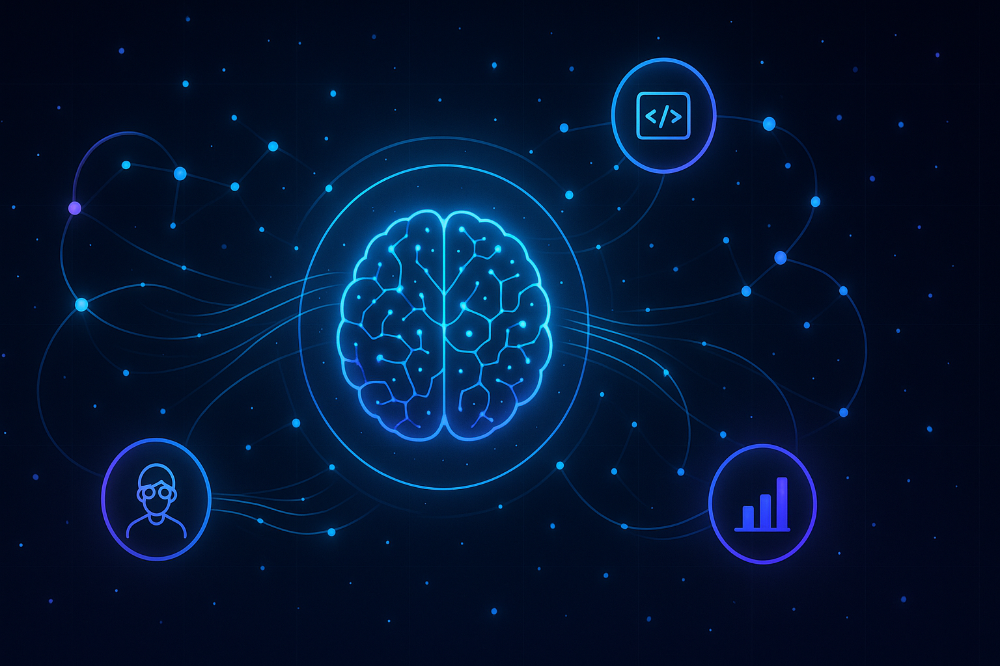
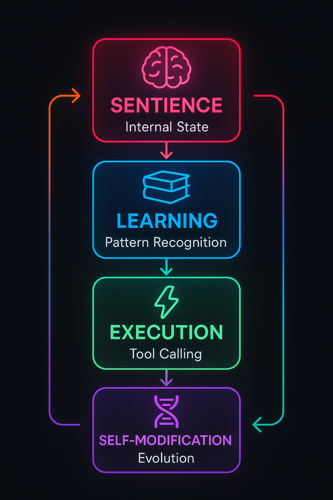
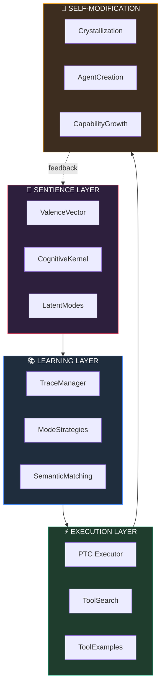
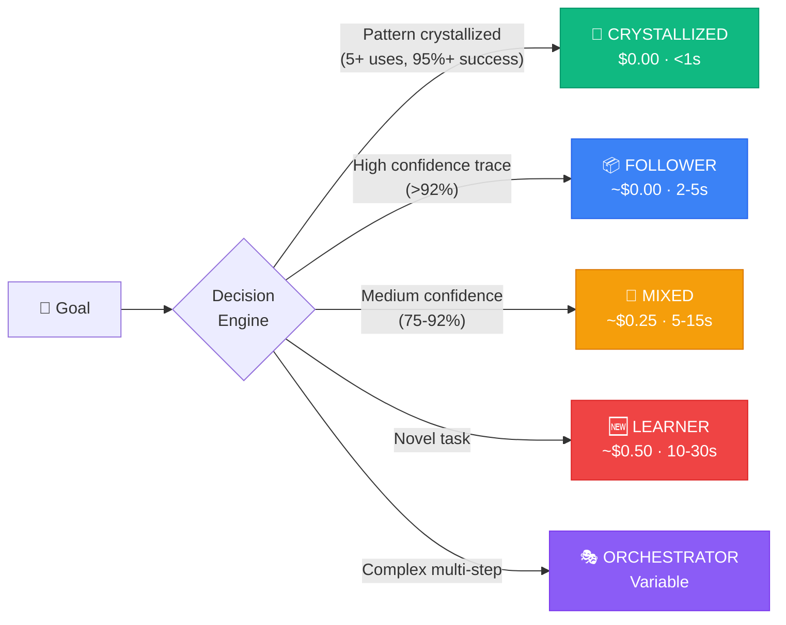
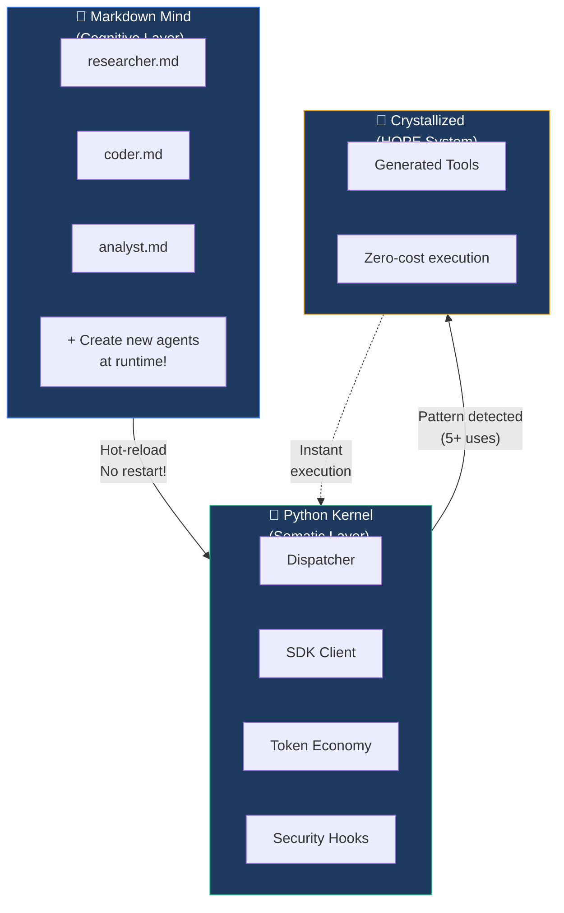
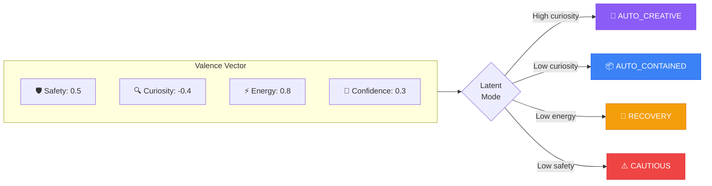
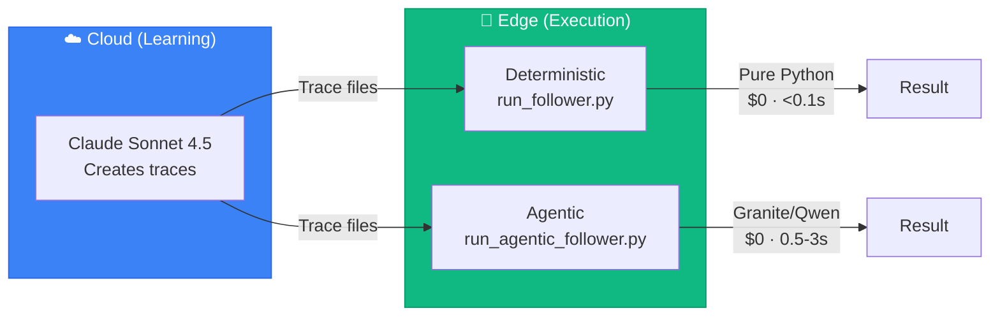

<div align="center">



# LLM OS

### The Operating System Where AI is the CPU

[](https://github.com/EvolvingAgentsLabs/llmunix/releases)
[](LICENSE)
[](https://python.org)
[](https://docs.anthropic.com)

**Learn once. Execute infinitely. Evolve continuously.**

[Quick Start](#-quick-start) · [Architecture](#-the-four-layer-stack) · [Examples](#-examples) · [Docs](ARCHITECTURE.md)

</div>

---

## What is LLM OS?

**LLM OS** treats Large Language Models as the **CPU** of a new kind of operating system. Just like traditional operating systems manage hardware resources, LLM OS manages *intelligence* as a resource—with budgets, scheduling, and optimization.

<div align="center">

<!-- Demo video/GIF will be added here -->
<table>
<tr>
<td align="center" width="600">

```
┌─────────────────────────────────────────────────────────────┐
│  $ python llmos/boot.py interactive                         │
│                                                             │
│  🚀 LLM OS v3.4.0 - Self-Evolving Operating System          │
│  💰 Budget: $10.00 | Mode: AUTO                             │
│                                                             │
│  > Create a Python calculator                               │
│                                                             │
│  [LEARNER] Novel task detected                              │
│  [SEARCH] Finding relevant tools...                         │
│  [EXECUTE] Creating calculator.py                           │
│  [TRACE] Saved execution trace                              │
│  [COST] $0.45 | Time: 12.3s                                 │
│                                                             │
│  > Create a Python calculator                               │
│                                                             │
│  [FOLLOWER] Found matching trace (98% confidence)           │
│  [PTC] Replaying tool sequence...                           │
│  [COMPLETE] calculator.py created                           │
│  [COST] $0.00 | Time: 0.8s  ✨ FREE!                        │
└─────────────────────────────────────────────────────────────┘
```

</td>
</tr>
</table>

</div>

### The Problem We Solve

<table>
<tr>
<td width="50%" align="center">

**Traditional LLM Apps**

</td>
<td width="50%" align="center">

**LLM OS**

</td>
</tr>
<tr>
<td>

```diff
- Same task = same cost every time
- All tools loaded upfront
- No memory between sessions
- Fixed behavior forever
- Manual orchestration required
```

</td>
<td>

```diff
+ Learn once, replay FREE
+ Discover tools on-demand
+ Persistent learning
+ Self-evolving agents
+ Automatic multi-agent
```

</td>
</tr>
</table>

### Key Numbers

<table>
<tr>
<th>Metric</th>
<th>Before</th>
<th>After LLM OS</th>
</tr>
<tr>
<td><strong>Repeated Task Cost</strong></td>
<td>$0.50/each</td>
<td><strong style="color: #10b981;">$0.00</strong> (after learning)</td>
</tr>
<tr>
<td><strong>Token Usage</strong></td>
<td>100%</td>
<td><strong style="color: #10b981;">10%</strong> (90% savings via PTC)</td>
</tr>
<tr>
<td><strong>Tool Context</strong></td>
<td>All tools loaded</td>
<td><strong style="color: #10b981;">On-demand</strong> (85% reduction)</td>
</tr>
<tr>
<td><strong>Response Time</strong></td>
<td>10-30s</td>
<td><strong style="color: #10b981;">&lt;1s</strong> (crystallized patterns)</td>
</tr>
</table>

---

## The Four-Layer Stack

LLM OS implements a unique architecture inspired by cognitive science:

<div align="center">



</div>



<details>
<summary><b>What each layer does</b></summary>

| Layer | Purpose | Key Question |
|-------|---------|--------------|
| **Sentience** | Persistent internal state that influences behavior | *"How do I feel about this task?"* |
| **Learning** | Pattern recognition and approach selection | *"What's the best way to do this?"* |
| **Execution** | Efficient task completion with token optimization | *"How do I execute efficiently?"* |
| **Self-Modification** | System evolution and capability growth | *"How can I improve?"* |

</details>

---

## Five Execution Modes

LLM OS automatically selects the optimal mode for each task:



### Cost Evolution Over Time

<div align="center">

```
    Cost per Execution ($)
    │
    │
0.50│  ██
    │  ██
    │  ██
0.25│  ██ ░░
    │  ██ ░░
    │  ██ ░░ ░░
0.00│──██─░░─░░─────────────────────────────────
    └──┬──┬──┬──┬──┬──┬──┬──┬──┬──┬──┬──┬──┬──┬─
       1  2  3  4  5  6  7  8  9  10 11 12 13 14
                   ▲
                   │
            Pattern Crystallized
             (FREE FOREVER)

    ██ = LEARNER ($0.50)    ░░ = FOLLOWER (~$0)    ── = CRYSTALLIZED ($0)
```

</div>

---

## Quick Start

### Installation

```bash
# Clone the repository
git clone https://github.com/EvolvingAgentsLabs/llmunix.git
cd llmunix

# Install dependencies
pip install -r requirements.txt

# Set your API key
export ANTHROPIC_API_KEY="your-key-here"
```

### Your First Execution

```bash
# Start interactive mode
python llmos/boot.py interactive
```

```python
# Or use programmatically
from llmos.boot import LLMOS

async def main():
    os = LLMOS(budget_usd=10.0)
    await os.boot()

    # First time: LEARNER mode (~$0.50)
    result = await os.execute("Create a Python calculator")

    # Second time: FOLLOWER mode (~$0.00)
    result = await os.execute("Create a Python calculator")

    # After 5+ times: CRYSTALLIZED mode ($0.00, <1s)

    await os.shutdown()
```

---

## Hybrid Architecture

LLM OS uses a unique **"Markdown Mind + Python Kernel"** architecture:



### Why This Matters

| Traditional | LLM OS |
|-------------|--------|
| Hardcoded agents | **Markdown files** (human-readable, git-versioned) |
| Restart to add agents | **Hot-reload** (instant availability) |
| Fixed capabilities | **Self-modification** (creates own agents) |
| Expensive patterns | **Crystallization** (patterns → Python tools) |

---

## Sentience Layer

*New in v3.4.0*

LLM OS has **persistent internal state** that influences behavior—like an AI that remembers how it "feels":



### Agents See Their Internal State

```python
# Injected into every agent's context:
[INTERNAL_STATE]
safety=0.50
curiosity=-0.40    # "I'm bored with repetitive tasks"
energy=0.80
latent_mode=auto_contained
[/INTERNAL_STATE]
```

---

## Examples

We provide **4 production-ready examples** showcasing different capabilities:

<table>
<tr>
<td width="50%">

### 🔬 Qiskit Studio
**Quantum Computing Backend**

```bash
cd examples/qiskit-studio
python server.py
```

✅ Full Execution Layer integration
✅ PTC for circuit generation
✅ Production FastAPI server

</td>
<td width="50%">

### 🎓 Q-Kids Studio
**Educational Platform**

```bash
cd examples/q-kids-studio
python server.py
```

✅ PTC at scale (1000+ users)
✅ Near-zero marginal cost
✅ Gamification system

</td>
</tr>
<tr>
<td width="50%">

### 🤖 RoboOS
**Robot Control System**

```bash
cd examples/robo-os
python demo.py
```

✅ Safety hooks (PreToolUse)
✅ Multi-agent coordination
✅ Real-time WebSocket updates

</td>
<td width="50%">

### 🎯 Demo App
**Interactive Showcase**

```bash
cd examples/demo-app
python demo_main.py
```

✅ All 5 execution modes
✅ Cost tracking
✅ Learning visualization

</td>
</tr>
</table>

---

## Edge Runtime

LLM OS includes an **edge runtime** for offline/local deployment:



```bash
# Deterministic execution (no LLM needed)
python edge_runtime/run_follower.py

# Agentic execution (local LLM via Ollama)
python edge_runtime/run_agentic_follower.py
```

---

## Project Structure

```
llmunix/
├── llmos/                     # 🐍 Python Kernel
│   ├── kernel/                # Core: sentience, config, hooks
│   ├── memory/                # Traces, storage, queries
│   ├── interfaces/            # Dispatcher, SDK client
│   ├── execution/             # PTC, tool search
│   └── plugins/               # System tools, generated
│
├── workspace/                 # 📝 Markdown Mind
│   ├── agents/                # Agent definitions
│   ├── memories/              # Traces, sessions
│   └── state/                 # Sentience persistence
│
├── edge_runtime/              # 📱 Edge Execution
│   ├── run_follower.py        # Deterministic
│   └── run_agentic_follower.py # Local LLM
│
├── examples/                  # 🎯 Production Examples
│   ├── qiskit-studio/         # Quantum computing
│   ├── q-kids-studio/         # Educational
│   ├── robo-os/               # Robotics
│   └── demo-app/              # Showcase
│
├── ARCHITECTURE.md            # 📖 Deep dive docs
└── README.md                  # 👋 You are here
```

---

## Configuration

```python
from llmos.kernel.config import LLMOSConfig

# Development (fast iteration)
config = LLMOSConfig.development()

# Production (full features)
config = LLMOSConfig.production()

# Custom
from llmos.kernel.config import ConfigBuilder
config = (ConfigBuilder()
    .with_budget(50.0)
    .with_sentience(True)
    .with_auto_crystallization(True)
    .build())
```

---

## Roadmap

- [x] **v3.4.0** - Sentience Layer
- [x] **v3.3.0** - Advanced Tool Use (PTC, Tool Search)
- [x] **v3.2.0** - Hybrid Architecture
- [ ] **v3.5.0** - Multi-modal support (vision, audio)
- [ ] **v4.0.0** - Distributed execution across nodes
- [ ] **v4.1.0** - Federation (multiple LLM OS instances)

---

## Contributing

We welcome contributions! See our [Contributing Guide](CONTRIBUTING.md) for details.

```bash
# Setup development environment
git clone https://github.com/EvolvingAgentsLabs/llmunix.git
cd llmunix
pip install -r requirements.txt

# Run tests
pytest tests/
```

---

## Community

- [GitHub Discussions](https://github.com/EvolvingAgentsLabs/llmunix/discussions) - Ask questions
- [Issues](https://github.com/EvolvingAgentsLabs/llmunix/issues) - Report bugs

---

## License

Apache 2.0 - See [LICENSE](LICENSE) for details.

---

<div align="center">

**Built with ❤️ by [Evolving Agents Labs](https://github.com/EvolvingAgentsLabs)**

*Making AI that learns, evolves, and improves itself.*

</div>
