<div align="center">

# LLM OS

### An AI That Learns While You Sleep

[](https://github.com/EvolvingAgentsLabs/llmunix/releases)
[](LICENSE)
[](https://python.org)

**Your AI doesn't just execute tasks. It evolves.**

[The Vision](#the-vision) · [How It Works](#how-it-works) · [Quick Start](#quick-start) · [Architecture](ARCHITECTURE.md)

</div>

---

## The Vision

Imagine an AI system that:

- **Learns from every interaction** and never forgets
- **Works in the background** analyzing and improving itself
- **Shares knowledge** across users, teams, and the entire organization
- **Tells you what it learned** with full transparency

This is LLM OS - an operating system where AI is the CPU, and **living processes** continuously evolve the system's capabilities.

```mermaid
graph TB
    subgraph "What happens when you're NOT using LLM OS"
        Sleep["😴 You sleep"]
        Crons["🤖 Sentience Crons wake up"]
        Analyze["📊 Analyze your traces"]
        Evolve["✨ Evolve artifacts"]
        Notify["📬 Prepare notifications"]

        Sleep --> Crons --> Analyze --> Evolve --> Notify
    end

    subgraph "What you see in the morning"
        Report["📋 Activity Report"]
        Insights["💡 New Insights"]
        Tools["🔧 Improved Tools"]
        Suggestions["🎯 Suggestions"]
    end

    Notify --> Report
    Notify --> Insights
    Notify --> Tools
    Notify --> Suggestions

    style Crons fill:#6366f1,color:#fff
    style Evolve fill:#10b981,color:#fff
    style Report fill:#f59e0b,color:#fff
```



---

## The Core Idea: Living Volumes

At the heart of LLM OS are **Volumes** - organized spaces where your AI's knowledge lives and grows.


**Volumes contain five artifact types:**

| Artifact | What it is | How it evolves |
|----------|------------|----------------|
| **Traces** | Recorded task executions | Summarized, consolidated, crystallized |
| **Tools** | Python functions | Optimized, improved, promoted |
| **Agents** | AI personalities | Refined, enhanced, specialized |
| **Insights** | Discovered patterns | Generated from analysis |
| **Suggestions** | Improvement ideas | Created by crons |

---

## Sentience Crons: Your AI Companions

**Sentience Crons** are not just background jobs - they're **creative thinking partners** that work alongside you. They analyze your work, learn from your team, and proactively suggest new approaches.

```mermaid
graph LR
    subgraph What["What Crons Do"]
        direction TB
        A1["📊 Analyze traces"]
        A2["✨ Evolve artifacts"]
        A3["💡 Suggest new approaches"]
        A4["🔮 Predict next steps"]
        A5["🎨 Creative problem-solving"]
    end

    subgraph Learn["Learning From"]
        direction TB
        L1["👤 Your work"]
        L2["👥 Team patterns"]
        L3["🌐 System knowledge"]
    end

    Learn --> What

    style What fill:#6366f1,color:#fff
    style Learn fill:#10b981,color:#fff
```




### What Each Cron Does

| Cron | Runs Every | Responsibilities |
|------|------------|------------------|
| **UserCron** | 30 min | Analyze your traces, suggest next steps, creative problem-solving, personal insights |
| **TeamCron** | 1 hour | Cross-pollinate ideas, find team patterns, suggest collaborative opportunities |
| **SystemCron** | 2 hours | Global optimization, coordinate all crons, surface organization-wide insights |

### Creative Capabilities

Crons don't just organize - they **think creatively**:

```
🔮 "Based on your recent database tasks and the team's API patterns,
    consider using the cached-query approach that worked well for Bob"

💡 "I noticed you've been debugging auth issues. The system volume has
    a battle-tested auth-validator tool that might help"

🎯 "Your next logical step might be: write integration tests.
    Similar traces in the team show 40% fewer bugs when tested early"
```

---

## Full Observability: See Everything

Every action taken by crons is tracked and visible. You're never in the dark about what your AI is doing.

```mermaid
sequenceDiagram
    participant U as 👤 User
    participant UC as 🤖 UserCron
    participant Hub as 📊 ObservabilityHub
    participant N as 📬 Notifications

    Note over UC: Background analysis cycle
    UC->>Hub: record_artifact_created("insight_001")
    UC->>Hub: record_proposal_created("crystallize_pattern")
    UC->>Hub: record_cycle_complete(3 tasks, 2.5s)

    Note over U: User checks in
    U->>Hub: get_activity_feed()
    Hub-->>U: [3 events in last hour]

    U->>Hub: get_pending_notifications()
    Hub-->>U: [1 insight, 1 suggestion]

    U->>Hub: acknowledge("insight_001")
    Hub-->>N: Mark as read
```



### Observable Events

```python
# Everything is tracked
EventType.CRON_STARTED          # Cron began running
EventType.ARTIFACT_CREATED      # New insight, tool, or agent
EventType.ARTIFACT_EVOLVED      # Existing artifact improved
EventType.ARTIFACT_PROMOTED     # Moved up the hierarchy
EventType.INSIGHT_GENERATED     # Pattern discovered
EventType.SUGGESTION_CREATED    # Improvement opportunity
```

### Query Your AI's Activity

```python
# What happened while I was away?
activity = kernel.get_activity_feed(since_hours=24)

# Any notifications for me?
notifications = kernel.get_cron_notifications()

# What changed in my volume?
changes = kernel.get_artifact_changes(volume_type="user")

# Show me the full report
print(kernel.format_activity_report())
```

---

## The Cron Terminal: Interactive Dashboard

LLM OS includes an interactive terminal for monitoring and interacting with your crons:

```
┌─────────────────────────────────────┬────────────────────────────────────────────────┐
│ 🤖 CRON PROCESSES                   │ 📋 CRON DETAILS: UserCron:alice                │
│                                     │                                                │
│ ▼ 🧠 SystemCron                     │ ┌─ Current Thinking ──────────────────────────┐│
│   │ ├─ Analyzing global patterns... │ │ Analyzing 12 recent traces...               ││
│   │ └─ 3 insights generated         │ │ Found pattern: "API integration tasks"      ││
│   │                                 │ │ Considering crystallization opportunity...  ││
│   ├─▼ 👥 TeamCron:engineering       │ └─────────────────────────────────────────────┘│
│   │   │ ├─ Aggregating team data... │                                                │
│   │   │ └─ 1 promotion pending      │ ┌─ Suggested Next Steps ──────────────────────┐│
│   │   │                             │ │ 1. 🎯 Complete the API error handling       ││
│   │   ├─ 👤 UserCron:alice [YOU]    │ │ 2. 💡 Consider using team's retry-logic     ││
│   │   │   ├─ 💭 Thinking...         │ │ 3. 🔮 Write tests (reduces bugs by 40%)     ││
│   │   │   └─ 2 suggestions ready    │ └─────────────────────────────────────────────┘│
│   │   │                             │                                                │
│   │   └─ 👤 UserCron:bob            │ ┌─ Recent Activity ───────────────────────────┐│
│   │       └─ Idle (last: 5m ago)    │ │ [10:32] Created insight: "API patterns"     ││
│   │                                 │ │ [10:31] Analyzed trace: api_handler_v3      ││
│   └─▼ 👥 TeamCron:design            │ │ [10:30] Cycle started                       ││
│       └─ 👤 UserCron:carol          │ └─────────────────────────────────────────────┘│
│           └─ 1 insight ready        │                                                │
│                                     │ ┌─ Interactive ────────────────────────────────┐│
│ [r] Refresh  [q] Quit               │ │ > Ask your cron: _                          ││
│                                     │ │                                              ││
└─────────────────────────────────────┴────────────────────────────────────────────────┘
```

**Features:**
- **Left Panel**: Live tree of all cron processes with activity summaries
- **Right Panel**: Detailed view of selected cron
- **Interactive Mode**: Chat with your UserCron to ask questions or give directions
- **Read-Only Mode**: View other crons' activity (team/system) without interaction

```bash
# Launch the cron terminal
python llmos/boot.py terminal --user alice --team engineering
```

---

## The Evolution Journey

When you use LLM OS, your knowledge flows through a continuous evolution cycle:

```mermaid
graph LR
    subgraph Execute["1️⃣ Execute"]
        Task["Run a task"]
        Trace["Create trace"]
    end

    subgraph Learn["2️⃣ Learn"]
        Pattern["Detect pattern"]
        Match["Semantic match"]
    end

    subgraph Evolve["3️⃣ Evolve"]
        Analyze["Cron analyzes"]
        Propose["Propose changes"]
        Apply["Apply evolution"]
    end

    subgraph Promote["4️⃣ Promote"]
        User2["User → Team"]
        Team2["Team → System"]
    end

    Task --> Trace --> Pattern --> Match
    Match --> Analyze --> Propose --> Apply
    Apply --> User2 --> Team2
    Team2 -.-> Task

    style Execute fill:#3b82f6,color:#fff
    style Learn fill:#8b5cf6,color:#fff
    style Evolve fill:#10b981,color:#fff
    style Promote fill:#f59e0b,color:#fff
```



### A Concrete Example

```
Day 1: You create a Python calculator
       → Trace saved to User Volume

Day 2: You create another calculator
       → UserCron notices: "Pattern detected!"
       → Insight generated: "Calculator tasks are common"

Day 5: Fifth calculator request
       → UserCron proposes: "Crystallize into tool?"
       → Tool created: calc_generator.py
       → Notification: "New tool available!"

Day 10: Your teammate creates a calculator
        → TeamCron notices: "Alice's tool works great"
        → Tool promoted to Team Volume
        → Team notification: "New team tool!"

Day 30: Multiple teams use the tool
        → SystemCron promotes to System Volume
        → Now available to everyone, forever
```

---

## On-Demand Agent Creation

LLM OS can **automatically create specialized agents** when you need them:

```bash
# First time running a quantum simulation?
python llmos/boot.py "Orchestrate VQE simulation with specialized agents"

# LLM OS automatically:
# 1. Plans the task and identifies needed agents
# 2. Creates ansatz-designer, optimizer-agent, vqe-executor
# 3. Saves them to workspace/agents/ for future use
# 4. Executes the multi-agent workflow
```

**No manual setup required.** The system designs domain-appropriate agents on-the-fly, solves the "cold-start" problem, and agents are reusable for future tasks.

---

## Quick Start

```bash
# Install
git clone https://github.com/EvolvingAgentsLabs/llmunix.git
cd llmunix
pip install -r requirements.txt
export ANTHROPIC_API_KEY="your-key"

# Run
python llmos/boot.py interactive
```

### Start with Crons

```python
from llmos.boot import LLMOS

async def main():
    os = LLMOS()
    await os.boot()

    # Start background evolution for your user
    os.kernel.start_crons(user_id="alice", team_id="engineering")

    # Work normally - crons evolve in the background
    await os.execute("Create a Python calculator")

    # Check what the crons discovered
    notifications = os.kernel.get_cron_notifications()
    for n in notifications:
        print(f"📬 {n['title']}: {n['description']}")

    await os.shutdown()
```

---

## How the Mechanisms Work

The cron and volume system is enabled by several underlying mechanisms:


| Mechanism | What it enables |
|-----------|-----------------|
| **Sentience Layer** | Crons make state-aware decisions (curiosity, safety, energy) |
| **Learning System** | Traces provide the data crons analyze |
| **Evolution Engine** | Proposes how artifacts should change |
| **Adaptive Agents** | Execute the analysis intelligently |
| **On-Demand Agent Creation** | Auto-creates specialized agents when needed |

---

## Project Structure

```
llmunix/
├── llmos/kernel/
│   ├── sentience_cron.py    # 🤖 UserCron, TeamCron, SystemCron
│   ├── volumes.py           # 📦 Volume architecture
│   ├── observability.py     # 📊 Event tracking & notifications
│   ├── evolution.py         # ✨ Artifact evolution engine
│   ├── sentience.py         # 🧠 Internal state management
│   └── cognitive_kernel.py  # 🎛️ Coordination layer
├── workspace/
│   └── volumes/             # 📁 Artifact storage
│       ├── users/           #    └── Per-user volumes
│       ├── teams/           #    └── Per-team volumes
│       └── system/          #    └── Global volume
└── examples/
```

---

## Why This Matters

Traditional AI systems are **stateless** - they don't remember, don't learn, don't improve.

LLM OS is **living** - it:

- **Remembers** every successful pattern
- **Learns** from repetition and failure
- **Improves** artifacts continuously
- **Shares** knowledge across boundaries
- **Reports** everything it does

The result: an AI that gets better at helping you, automatically, while you sleep.

---

## Learn More

- **[Architecture Guide](ARCHITECTURE.md)** - Deep dive into all components
- **[Examples](examples/)** - Production-ready implementations

---

<div align="center">

**[Evolving Agents Labs](https://github.com/EvolvingAgentsLabs)**

*Building AI that evolves*

</div>
